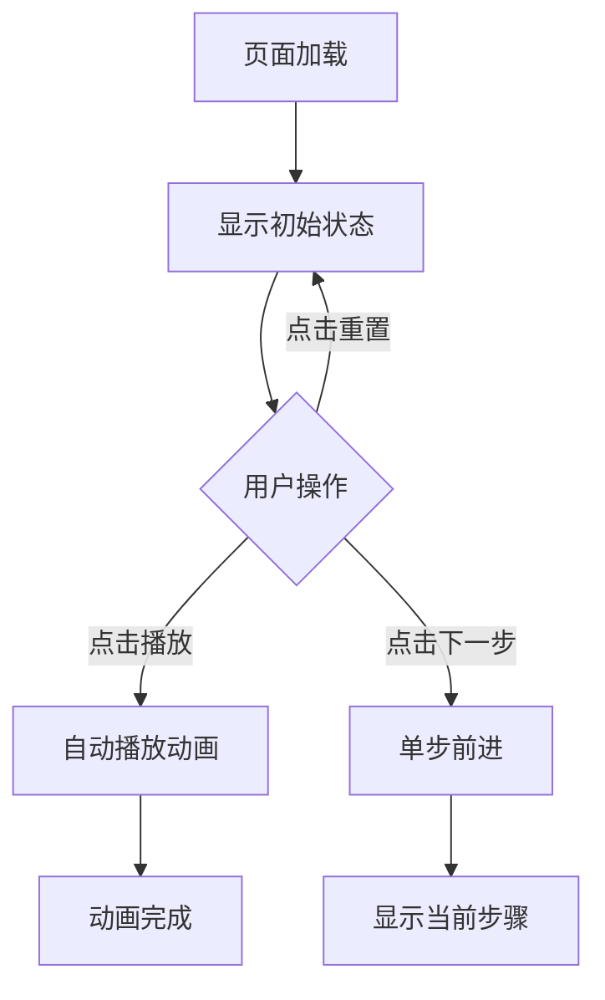

# Continuous Batching 可视化演示 PRD

## 1. Product Overview
连续批处理是大语言模型推理中提高GPU利用率的关键技术。本产品通过优雅的可视化动画，帮助开发者理解静态批处理和连续批处理的区别。
- 目标：直观展示连续批处理如何动态调度请求，提高GPU利用率
- 目标用户：AI/ML开发者、系统架构师、技术爱好者

## 2. Core Features

### 2.2 Feature Module
1. **对比视图**：左侧静态批处理，右侧连续批处理，实时对比
2. **时间线表格**：每个时间步展示GPU计算的token
3. **状态可视化**：Prefill/Decode阶段、KV Cache状态、完成标识
4. **交互控制**：播放/暂停、单步前进、重置、速度调节

### 2.3 Page Details
| Page Name | Module Name | Feature description |
|-----------|-------------|---------------------|
| Demo page | Header | 标题、简洁说明、图例 |
| Demo page | Compare grid | 左右分栏对比两种方案 |
| Demo page | Timeline table | 时间线表格，彩色编码token类型 |
| Demo page | GPU state | GPU当前计算的token，脉动动画 |
| Demo page | Controls | 操作按钮、速度滑块、步骤说明 |

## 3. Core Process
用户打开页面 → 阅读说明 → 点击播放观看动画 → 使用单步控制深入理解 → 对比两种方案差异

## 4. User Interface Design

### 4.1 Design Style
- **颜色**：深紫蓝调背景 (#0f0c29 → #302b63 → #24243e)，金色/青色渐变强调
- **按钮**：大圆角胶囊形状，渐变填充，悬停发光效果
- **字体**：JetBrains Mono (代码感) + Inter (现代感)
- **布局**：对称分栏卡片式设计，毛玻璃效果
- **图标**：线条简洁的线性图标

### 4.2 Page Design Overview
| Page Name | Module Name | UI Elements |
|-----------|-------------|-------------|
| Demo page | Header | 渐变标题，副标题，图例卡片 |
| Demo page | Timeline | 彩色表格，token高亮，淡入效果 |
| Demo page | GPU box | 毛玻璃容器，脉冲动画，徽章标签 |
| Demo page | Controls | 按钮组，滑块，步骤指示器 |

### 4.3 Responsiveness
- Desktop-first，自适应分栏
- Tablet/手机单列布局
- 触摸优化的按钮尺寸

