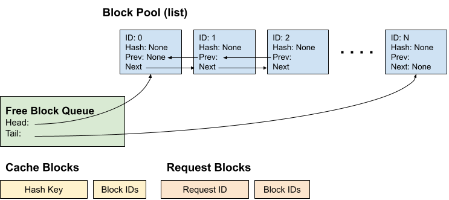
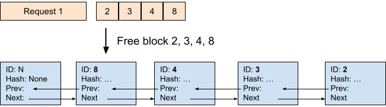
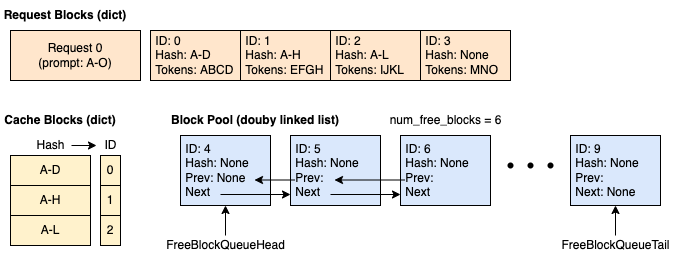
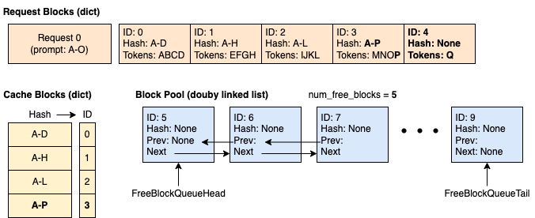
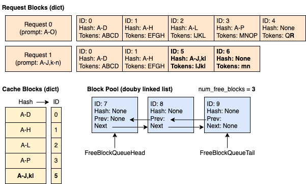

# 从零到熟悉 vLLM Automatic Prefix Caching：原理、源码与实践

> 本文将带大家从零开始，逐步理解 vLLM 中的 **Automatic Prefix Caching (APC)** 机制。我们将从直觉出发，逐步深入到核心数据结构、哈希算法、LRU 驱逐策略，并结合最新的 vLLM v1 源码进行逐行分析。

---

## 一、为什么需要 Prefix Caching？

### 1.1 LLM 推理的瓶颈在哪？

在 LLM 推理中，每一层 Transformer 都需要为输入 token 计算 Key-Value 对（KV Cache）。当我们有一段很长的系统提示（System Prompt），每个请求都要重新计算这些相同前缀的 KV Cache，这是巨大的浪费。

举个具体例子：

```
请求 1: [系统提示 (2000 tokens)] + "今天天气怎么样？"
请求 2: [系统提示 (2000 tokens)] + "帮我写一首诗。"
请求 3: [系统提示 (2000 tokens)] + "解释一下量子力学。"
```

三个请求共享了 2000 tokens 的系统提示前缀。如果没有 Prefix Caching，每个请求都需要计算 2000 tokens 的 KV Cache，而实际上我们只需要计算一次，后续请求直接复用就好。

### 1.2 APC 的核心思想

**Automatic Prefix Caching** 的核心思想用一句话概括：

> 缓存已经计算过的 KV Cache Block，当新请求与已有请求共享相同前缀时，直接复用对应的 KV Block，跳过重复的 Prefill 计算。

关键词：**自动**。不需要用户手动标注哪些是前缀，vLLM 通过哈希匹配自动发现和复用共享前缀。

### 1.3 适用场景

| 场景 | 描述 | 性能提升 |
|------|------|----------|
| **长文档问答** | 多个问题针对同一篇文档 | 显著减少 TTFT |
| **多轮对话** | 对话历史作为共享前缀 | 减少前缀重复计算 |
| **共享系统提示** | 多用户共用同一 System Prompt | 大量减少冗余计算 |
| **Few-shot 学习** | 多请求共享相同的示例前缀 | 首 token 延迟大幅降低 |

---

## 二、前置知识：PagedAttention 与 Block

在理解 APC 之前，我们需要先理解 vLLM 的内存管理基础——**PagedAttention**。

### 2.1 从操作系统到 KV Cache

PagedAttention 的灵感来自操作系统的虚拟内存和分页机制：

| 操作系统概念 | vLLM 对应概念 |
|---|---|
| 物理页 (Physical Page) | 物理 Block (GPU 上的 KV Cache 块) |
| 虚拟页 (Virtual Page) | 逻辑 Block (请求的 token 序列中的一段) |
| 页表 (Page Table) | Block Table（逻辑到物理的映射） |
| 页大小 (Page Size) | Block Size（每个 block 存储的 token 数） |

### 2.2 Block 的结构

假设 `block_size = 4`，一个包含 15 个 token 的请求会被分成：

```
Token 序列: [t0, t1, t2, t3, t4, t5, t6, t7, t8, t9, t10, t11, t12, t13, t14]

Block 0: [t0,  t1,  t2,  t3 ]  ← 满块
Block 1: [t4,  t5,  t6,  t7 ]  ← 满块
Block 2: [t8,  t9,  t10, t11]  ← 满块
Block 3: [t12, t13, t14,    ]  ← 非满块（不会被缓存）
```

**关键规则：只有满块才能被缓存。** 这是因为只有满块的内容是完整且确定的，可以唯一标识。

---

## 三、APC 的核心机制：哈希匹配

### 3.1 Block 的唯一标识

APC 的核心问题是：**如何判断两个 Block 的 KV Cache 是相同的？**

vLLM 的答案是：对 Block 的内容计算哈希值。具有相同哈希值的 Block 就认为内容相同，可以复用。

但这里有一个关键细节——单纯对 Block 中的 token 做哈希是不够的。因为：

```
请求 A: [Hello, world, how, are] [you, doing, today, ?]
请求 B: [I, am, doing, fine] [you, doing, today, ?]
```

Block A-1 和 Block B-1 都包含 `[you, doing, today, ?]`，但它们的 KV Cache 是不同的！因为 Attention 机制中，每个 token 的 KV 对依赖于它之前所有 token 的上下文。

### 3.2 链式哈希设计

为此，vLLM 采用了**链式哈希**（Chain Hashing）的设计：

```
Block 0 的 hash = hash(NONE_HASH, block_0_tokens, extra_keys)
Block 1 的 hash = hash(Block_0_hash, block_1_tokens, extra_keys)
Block 2 的 hash = hash(Block_1_hash, block_2_tokens, extra_keys)
...
```

每个 Block 的哈希值包含三个组件：
1. **父 Block 的哈希值** (parent_block_hash)：编码了所有前缀信息
2. **当前 Block 的 token IDs** (curr_block_token_ids)：编码了当前块的内容
3. **额外的键** (extra_keys)：LoRA ID、多模态输入哈希、cache_salt 等

这样，只有当两个 Block 的所有前缀 token 和当前 token 都完全相同时，它们的哈希才会相同。

### 3.3 源码分析：`hash_block_tokens`

来看 `vllm/v1/core/kv_cache_utils.py` 中的核心哈希函数：

```python
# vllm/v1/core/kv_cache_utils.py

def hash_block_tokens(
    hash_function: Callable[[Any], bytes],
    parent_block_hash: BlockHash | None,
    curr_block_token_ids: Sequence[int],
    extra_keys: tuple[Any, ...] | None = None,
) -> BlockHash:
    """
    计算一个 Block 的哈希值。
    hash_function: 哈希算法（默认 sha256）
    parent_block_hash: 父 Block 的哈希（编码了前缀信息）
    curr_block_token_ids: 当前 Block 的 token IDs
    extra_keys: 额外的键（LoRA、多模态等）
    """
    if not parent_block_hash:
        parent_block_hash = NONE_HASH  # 第一个 Block 使用随机种子

    curr_block_token_ids_tuple = tuple(curr_block_token_ids)
    return BlockHash(
        hash_function((parent_block_hash, curr_block_token_ids_tuple, extra_keys))
    )
```

让我们用一个具体例子来理解：

**例子**：句子 "A gentle breeze stirred the leaves as children laughed in the distance"，Block Size = 5

| Block ID | 内容 | 哈希输入 | 哈希输出 | 缓存? |
|----------|------|---------|---------|------|
| 0 | A, gentle, breeze, stirred, the | (NONE_HASH, (A, g, b, s, t), None) | hash_0 = sha256(...) | ✓ 满块 |
| 1 | leaves, as, children, laughed, in | (hash_0, (l, a, c, l, i), None) | hash_1 = sha256(...) | ✓ 满块 |
| 2 | the, distance | 不计算 | N/A | ✗ 不满块 |

关键观察：
- Block 0 的哈希包含 NONE_HASH（初始种子）+ Block 0 的 token
- Block 1 的哈希包含 hash_0（编码了前 5 个 token）+ Block 1 的 token
- 这种链式设计确保了**只有完全相同的前缀才能命中缓存**

### 3.4 哈希算法选择

vLLM v0.11+ 支持多种哈希算法：

| 算法 | 特点 | 适用场景 |
|------|------|----------|
| `sha256`（默认） | 加密级别安全，使用 pickle 序列化 | 通用场景 |
| `sha256_cbor` | 跨语言可复现 | 需要确定性缓存的环境 |
| `xxhash` | 更快，非加密 | 性能敏感场景 |
| `xxhash_cbor` | 快+可复现 | 两者兼顾 |

通过 `--prefix-caching-hash-algo` 参数控制。

---

## 四、数据结构深入：BlockPool 与 FreeKVCacheBlockQueue

### 4.1 整体架构

APC 在 vLLM v1 中的核心数据结构包括四个部分：



图中各组件的职责如下：

| 组件 | 数据结构 | 职责 |
|------|----------|------|
| **Block Pool (list)** | `list[KVCacheBlock]` | 预分配所有 KV Cache 块，通过 block_id 索引访问 |
| **Free Block Queue** | 双向链表 (Head ↔ Tail) | 维护空闲块的 LRU 驱逐顺序，支持 O(1) 头部弹出、尾部追加、中间删除 |
| **Cache Blocks** | `dict[BlockHash, KVCacheBlock]` | 哈希到已缓存块的映射，用于前缀匹配查找 |
| **Request Blocks** | `dict[RequestID, list[int]]` | 每个请求当前持有的 block_id 列表 |

每个 KVCacheBlock 同时承担两个角色：在 Block Pool 中通过 `block_id` 被索引，在 Free Block Queue 中通过内嵌的 `prev_free_block` / `next_free_block` 指针形成链表。这种设计避免了额外的包装对象，是 vLLM 高性能的关键之一。

### 4.2 KVCacheBlock 数据类

```python
# vllm/v1/core/kv_cache_utils.py

@dataclass(slots=True)
class KVCacheBlock:
    # Block ID（不可变，0 到 num_gpu_blocks-1）
    block_id: int
    # 引用计数：有多少请求正在使用这个块
    ref_cnt: int = 0
    # 块的哈希值（只有满块且被缓存时才有值）
    _block_hash: BlockHashWithGroupId | None = None

    # 双向链表指针（用于构造 Free Block Queue）
    prev_free_block: "KVCacheBlock | None" = None
    next_free_block: "KVCacheBlock | None" = None

    # 是否为占位符空块
    is_null: bool = False
```

设计亮点：
- **预分配所有 Block 对象**：初始化时就创建所有 KVCacheBlock，避免运行时 Python 对象创建开销
- **双向链表指针内嵌在 Block 中**：避免额外的 Python 包装对象，使得链表操作为 O(1) 且零额外内存分配

### 4.3 FreeKVCacheBlockQueue：精巧的 LRU 实现

这是 APC 中最精巧的数据结构之一——一个自定义的双向链表，用于维护空闲块的 LRU 驱逐顺序：

```python
# vllm/v1/core/kv_cache_utils.py

class FreeKVCacheBlockQueue:
    """
    双向链表实现的空闲块队列。
    
    为什么不用 Python 的 deque？
    1. 需要支持从链表中间 O(1) 删除（当缓存命中时）
    2. 避免额外的 Python 对象包装（直接操作 Block 的指针属性）
    
    驱逐顺序：
    1. 最近最少使用的块在队首（LRU）
    2. 同时被释放的块中，哈希更多 token 的块优先驱逐
       （因为哈希更多 token 意味着更不可能被其他请求复用）
    """
    def __init__(self, blocks: list[KVCacheBlock]) -> None:
        self.num_free_blocks = len(blocks)
        # 初始化连续 Block 之间的双向链接
        for i in range(self.num_free_blocks):
            if i > 0:
                blocks[i].prev_free_block = blocks[i - 1]
            if i < self.num_free_blocks - 1:
                blocks[i].next_free_block = blocks[i + 1]
        
        # 哨兵头尾节点（简化边界条件处理）
        self.fake_free_list_head = KVCacheBlock(block_id=-1)
        self.fake_free_list_tail = KVCacheBlock(block_id=-1)
        # ... 连接头尾
```

核心操作时间复杂度：

| 操作 | 时间复杂度 | 说明 |
|------|-----------|------|
| `popleft()` | O(1) | 从队首取出最老的块（用于分配） |
| `append()` | O(1) | 将释放的块加到队尾（最新） |
| `remove()` | O(1) | 从中间移除块（缓存命中时） |

### 4.4 BlockHashToBlockMap：哈希到块的映射

```python
# vllm/v1/core/block_pool.py

class BlockHashToBlockMap:
    """
    缓存块的哈希映射。
    
    设计要点：
    - 大多数情况下一个 hash 对应一个 block（直接存 KVCacheBlock）
    - 极少数情况存在重复 block（此时用 dict 存多个 block）
    - 这种联合类型设计减少了 GC 开销
    """
    def __init__(self):
        self._cache: dict[
            BlockHashWithGroupId, KVCacheBlock | dict[int, KVCacheBlock]
        ] = {}
```

为什么会有重复块？因为 vLLM v1 的 Block Table 是 **append-only** 的。当一个新请求生成的 Block 和已有缓存 Block 内容相同时，不会替换已分配的 Block ID，而是标记为重复。重复在请求释放时自动消除。

---

## 五、完整工作流程：从请求到缓存

### 5.1 新请求到来

```
步骤 1: Scheduler 调用 kv_cache_manager.get_computed_blocks(request)
    → 对请求的 prompt tokens 计算 block hash
    → 在 cached_block_hash_to_block 中查找匹配
    → 返回已缓存的 block 列表和已计算 token 数

步骤 2: Scheduler 调用 kv_cache_manager.allocate_slots(request, ...)
    → 计算需要新分配的 block 数量
    → "Touch" 缓存命中的块（增加引用计数，从 free queue 移除）
    → 从 free queue 队首分配新块（如果头部块是已缓存的，先驱逐）
    → 如果新分配的块已满，立即缓存它
```

### 5.2 源码追踪：`get_computed_blocks`

```python
# vllm/v1/core/kv_cache_manager.py

def get_computed_blocks(self, request: Request) -> tuple[KVCacheBlocks, int]:
    """获取请求的已缓存块"""
    
    # 如果禁用了缓存或请求标记为跳过缓存读取
    if not self.enable_caching or request.skip_reading_prefix_cache:
        return self.empty_kv_cache_blocks, 0

    # 关键：设置最大缓存命中长度 = prompt_length - 1
    # 原因：即使所有 token 命中缓存，也必须重新计算最后一个 token
    # 以获取 logits（用于生成下一个 token）
    max_cache_hit_length = request.num_tokens - 1
    
    computed_blocks, num_new_computed_tokens = (
        self.coordinator.find_longest_cache_hit(
            request.block_hashes, max_cache_hit_length
        )
    )
    return self.create_kv_cache_blocks(computed_blocks), num_new_computed_tokens
```

### 5.3 Touch 操作：缓存命中时的处理

当一个 Block 被缓存命中时，Touch 操作用来"保护"这个块不被驱逐：

```python
# vllm/v1/core/block_pool.py

def touch(self, blocks: Sequence[KVCacheBlock]) -> None:
    """Touch 一个 block：增加引用计数，必要时从 free queue 移除"""
    for block in blocks:
        # ref_cnt == 0 意味着这个 block 在 free list 中（是驱逐候选）
        # 现在有人要用它了，得保护它不被驱逐
        if block.ref_cnt == 0 and not block.is_null:
            self.free_block_queue.remove(block)  # O(1) 从中间移除！
        block.ref_cnt += 1
```

**Touch 操作的效果**：

| 状态 | Touch 前 | Touch 后 |
|------|---------|---------|
| **ref_cnt** | 0（未被使用） | 1（被新请求使用） |
| **在 Free Queue 中?** | 是（驱逐候选） | 否（被保护） |
| **是否会被驱逐?** | 可能会 | 不会（直到 ref_cnt 再次降为 0） |

这就是为什么 Free Queue 使用双向链表而非普通 deque 的原因——**我们需要从中间 O(1) 移除元素**，这对缓存命中的高频操作至关重要。

### 5.4 请求完成时的释放

```python
# vllm/v1/core/block_pool.py

def free_blocks(self, ordered_blocks: Iterable[KVCacheBlock]) -> None:
    """释放块。按驱逐优先级排序（先释放的优先驱逐）"""
    blocks_list = list(ordered_blocks)
    for block in blocks_list:
        block.ref_cnt -= 1
    # 只有引用计数降为 0 的块才加入 free queue
    self.free_block_queue.append_n(
        [block for block in blocks_list 
         if block.ref_cnt == 0 and not block.is_null]
    )
```

**关键细节**：释放时块的顺序是**逆序**的（从请求的最后一个块到第一个块）。原因：

- 最后的块哈希了更多的前缀 token，被其他请求复用的概率更低
- 因此应该**优先被驱逐**
- 而靠前的块（如共享的系统提示）更可能被其他请求复用，应该**尽量保留**

下图展示了请求释放时块加入 Free Queue 的逆序关系：



当 Request 1 释放块 2, 3, 4, 8 时，它们**按逆序**添加到 Free Queue 的尾部，使得块 8（哈希最多 token）最先被驱逐候选。

### 5.5 驱逐策略

当需要新块但 free queue 头部是缓存块时：

```python
# vllm/v1/core/block_pool.py

def _maybe_evict_cached_block(self, block: KVCacheBlock) -> bool:
    """如果块在缓存中，驱逐它"""
    block_hash = block.block_hash
    if block_hash is None:
        return False  # 块没有 hash，不需要驱逐
    
    # 从缓存映射中移除
    if self.cached_block_hash_to_block.pop(block_hash, block.block_id) is None:
        return False
    
    # 清除哈希
    block.reset_hash()
    return True
```

驱逐后，其他请求就无法再通过哈希命中这个块了，但块的物理内容还在，可以被新数据覆盖。

---

## 六、端到端示例

现在让我用一个具体的例子，从缓存空时的请求分配，到多请求缓存共享，再到驱逐，详细演示整个流程的每一步。

### 时刻 1：空缓存，新请求到来



首个请求分配了 3 个完整块（ID: 0, 1, 2），都已被计算并缓存。Cache Blocks 记录了三个哈希值（A-D, A-H, A-L）到块的映射。剩余 6 个块在 Free Queue 中等待分配。

### 时刻 2：第二个请求到来，缓存命中



请求 1 的前 8 个 token 与请求 0 相同：
- Block 0 (A-D) 命中缓存 ✓
- Block 1 (A-H) 命中缓存 ✓
- Block 2 不命中（第 9 个 token 不同），需要新分配 Block 5（A-J-kl）

注意：两个请求现在共享 Block 0 和 Block 1，它们的 ref_cnt 保护这些块不被驱逐。

### 时刻 3：请求 0 完成，释放块



请求 0 释放时，块按**逆序**加入 Free Queue：先释放 Block 4（Q），再 3（ijkl），再 2（A-L）。但请求 1 仍在使用 Block 0, 1, 5，所以这三个块的 ref_cnt 仍大于 0，不加入 Free Queue。

Free Queue 现在的顺序优化了驱逐：最后的块（哈希最多 token）最先被驱逐候选。

### 完整工作流要点

通过这个示例我们看到：
1. **缓存命中 = 跳过 Prefill 计算**：新请求无需重新计算已缓存的前缀块
2. **引用计数保护**：共享块的 ref_cnt > 0，不会被驱逐
3. **逆序释放的智能性**：尽量保留通用性强的前缀块（短块），优先驱逐特化的后缀块（长块）

---

## 七、多模态输入的处理

APC 对多模态输入（如图片）有特殊处理。图片被 tokenizer 转换为一系列 placeholder tokens，但不同图片的 placeholder 是相同的。如何区分？

```python
# vllm/v1/core/kv_cache_utils.py

def _gen_mm_extra_hash_keys(
    request: Request, start_token_idx: int, end_token_idx: int, start_mm_idx: int
) -> tuple[list[Any], int]:
    """生成多模态相关的额外哈希键"""
    extra_keys: list[Any] = []
    mm_features = request.mm_features
    
    # 遍历多模态输入，检查是否与当前 block 重叠
    curr_mm_idx = start_mm_idx
    while mm_features and curr_mm_idx < len(mm_features):
        mm_feature = mm_features[curr_mm_idx]
        offset = mm_feature.mm_position.offset
        length = mm_feature.mm_position.length
        
        if end_token_idx > offset:
            if start_token_idx >= offset + length:
                curr_mm_idx += 1
                continue
            # 包含 (图片标识符, 相对偏移) 作为额外键
            extra_keys.append((mm_feature.identifier, offset - start_token_idx))
            # ...
    return extra_keys, curr_mm_idx
```

这确保了包含不同图片的 Block 即使 placeholder token 相同，哈希值也不同。

---

## 八、Cache 隔离：多租户安全

在共享环境中，不同用户的缓存需要隔离，防止通过延迟差异推断其他用户的输入内容（侧信道攻击）。

vLLM 支持通过 `cache_salt` 实现缓存隔离：

```json
{
  "messages": [...],
  "cache_salt": "user-123-secret"
}
```

`cache_salt` 会被注入到第一个 Block 的哈希计算中：

```python
# vllm/v1/core/kv_cache_utils.py

def generate_block_hash_extra_keys(request, start_token_idx, end_token_idx, ...):
    # ...
    cache_salt_keys: list[str] = (
        [request.cache_salt] if (start_token_idx == 0 and request.cache_salt) else []
    )
    extra_keys = lora_extra_keys + mm_extra_keys + cache_salt_keys + prompt_embeds_keys
    # ...
```

注意 `cache_salt` **只在第一个 Block**（`start_token_idx == 0`）中生效，但由于链式哈希的设计，它会传播到所有后续 Block。

---

## 九、性能优化细节

### 9.1 零内存分配的链表操作

vLLM 没有使用 Python 的 `collections.deque`，而是自己实现了双向链表。对比如下：

| 特性 | `collections.deque` | vLLM 自定义链表 |
|------|-------------------|-----------------|
| **popleft()** | O(1) | O(1) |
| **append()** | O(1) | O(1) |
| **remove()** | O(n) ⚠️ | O(1) ✓ |
| **内存开销** | 额外 Python dict + 引用 | 直接内嵌在 Block 属性 |
| **GC 压力** | 每个元素都是 Python 对象 | 无额外对象 |

vLLM 的设计特别优化了 **remove()** 操作，这在缓存命中时频繁调用——从 Free Queue 中移除一个块以保护它不被驱逐。由于链表指针直接内嵌在 KVCacheBlock 的 `prev_free_block` / `next_free_block` 属性中，移除操作完全不需要分配新对象，避免了 GC 压力。

### 9.2 预分配所有 Block 对象

```python
# vllm/v1/core/block_pool.py

class BlockPool:
    def __init__(self, num_gpu_blocks: int, ...):
        # 一次性创建所有 Block 对象
        self.blocks: list[KVCacheBlock] = [
            KVCacheBlock(idx) for idx in range(num_gpu_blocks)
        ]
        # 用所有块初始化 free queue
        self.free_block_queue = FreeKVCacheBlockQueue(self.blocks)
```

运行时不会创建新的 KVCacheBlock 对象，避免了 Python 对象创建和 GC 的开销。

### 9.3 Null Block 优化

```python
# 第一个块（ID=0）被保留为 null block
self.null_block = self.free_block_queue.popleft()
self.null_block.is_null = True
```

Null Block 用于占位（例如滑动窗口注意力中已不需要的块），避免特殊的 None 检查。

### 9.4 BlockHashToBlockMap 的联合类型优化

```python
# 大多数 hash 对应单个 block → 直接存 KVCacheBlock（无 dict 开销）
# 极少数 hash 有重复 → 升级为 dict
self._cache: dict[BlockHashWithGroupId, KVCacheBlock | dict[int, KVCacheBlock]] = {}
```

---

## 十、实战：如何使用 APC

### 10.1 启用 APC

```python
from vllm import LLM, SamplingParams

# 只需一个参数即可启用
llm = LLM(
    model="your-model-name",
    enable_prefix_caching=True  # ← 就这一行
)
```

在 vLLM v1 中，APC 默认启用（`enable_prefix_caching` 默认为 True）。

### 10.2 完整示例：长文档问答

```python
import time
from vllm import LLM, SamplingParams

# 启用 APC
llm = LLM(model="lmsys/longchat-13b-16k", enable_prefix_caching=True)
sampling_params = SamplingParams(temperature=0, max_tokens=100)

# 长文档作为共享前缀
LONG_DOC = "这是一篇很长的文档..." * 500  # 假设 2000+ tokens

# 第一个问题：需要完整计算前缀
start = time.time()
output1 = llm.generate(LONG_DOC + "问题1：文档主题是什么？", sampling_params)
time1 = time.time() - start
print(f"第一次查询耗时: {time1:.2f}s")

# 第二个问题：前缀已缓存，只需计算新增部分
start = time.time()
output2 = llm.generate(LONG_DOC + "问题2：有哪些关键发现？", sampling_params)
time2 = time.time() - start
print(f"第二次查询耗时: {time2:.2f}s")
print(f"加速比: {time1/time2:.1f}x")
```

预期输出：
```
第一次查询耗时: 5.23s
第二次查询耗时: 0.87s
加速比: 6.0x
```

### 10.3 服务端部署

```bash
vllm serve your-model-name \
    --enable-prefix-caching \
    --prefix-caching-hash-algo sha256
```

---

## 十一、APC 的限制

1. **只加速 Prefill，不加速 Decode**：如果大部分时间花在生成（decode）阶段，APC 的收益有限
2. **需要共享前缀**：如果请求之间没有共同前缀，APC 没有效果
3. **只缓存满块**：最后一个不满的 Block 永远需要重新计算
4. **Block 对齐要求**：`num_computed_tokens` 必须是 block_size 的整数倍，可能导致多重计算几个 token
5. **内存开销**：缓存块占据 GPU 显存，可能限制同时处理的请求数

---

## 十二、与其他框架的对比

| 特性 | vLLM APC | SGLang RadixAttention | TensorRT-LLM |
|------|----------|----------------------|---------------|
| 缓存粒度 | Block 级 | Token 级（Radix Tree） | Block 级 |
| 查找方式 | Hash Table | Radix Tree | Hash Table |
| 驱逐策略 | LRU | LRU | LRU |
| 自动发现 | ✓ | ✓ | ✓ |
| 多模态支持 | ✓ | ✓ | 部分 |
| LoRA 支持 | ✓ | ✗ | ✗ |
| Cache Salt | ✓ | ✗ | ✗ |

---

## 十三、总结

vLLM 的 Automatic Prefix Caching 通过以下几个精妙的设计实现了高效的 KV Cache 复用：

1. **链式哈希**：通过将父 Block 的哈希作为输入，确保了前缀相同才能命中
2. **双向链表 Free Queue**：实现了 O(1) 的分配、释放和缓存命中时的移除
3. **LRU 驱逐 + 逆序释放**：优先保留更短（更通用）的前缀缓存
4. **预分配 + 零额外对象**：最大限度减少 Python GC 开销
5. **额外键机制**：统一处理 LoRA、多模态、cache salt 等场景

如果你正在部署 LLM 服务，且满足以下任一条件，APC 几乎是免费的午餐：
- 多个请求共享相同的系统提示
- 多轮对话场景
- 长文档上的多次查询
- 使用 few-shot 示例

