# vLLM V1 核心推理引擎：多进程架构设计深度解析

> 深入剖析 vLLM V1 的核心推理引擎架构，理解多进程设计、进程间通信、调度器与执行器的协作机制

---

## 目录

1. [架构演进：从单进程到多进程](#1-架构演进从单进程到多进程)
2. [V1 架构全景图与设计理念](#2-v1-架构全景图与设计理念)
3. [进程组成详解：各司其职](#3-进程组成详解各司其职)
4. [进程间通信机制：高效协作](#4-进程间通信机制高效协作)
5. [调度器深度解析：智能决策](#5-调度器深度解析智能决策)
6. [KV Cache 管理：内存优化核心](#6-kv-cache-管理内存优化核心)
7. [请求完整生命周期：端到端流程](#7-请求完整生命周期端到端流程)
8. [分布式部署与并行策略](#8-分布式部署与并行策略)
9. [生产环境最佳实践](#9-生产环境最佳实践)

---

## 1. 架构演进：从单进程到多进程

### 1.1 单进程架构的局限性

在 vLLM V0.x 版本中，采用的是单进程架构。这种设计虽然简单，但在实际生产中暴露出诸多问题：

**问题一：资源争用严重**
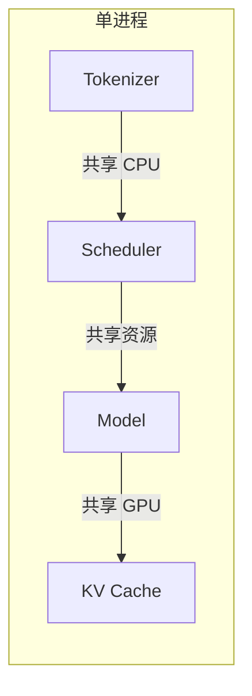

- CPU 密集型任务（如 tokenization）与 GPU 密集型任务（模型推理）竞争资源
- Python GIL 限制了多线程并行效率
- 内存管理复杂，容易出现内存碎片

**问题二：扩展性有限**
- 无法充分利用多核 CPU
- 难以实现真正的分布式部署
- 资源无法弹性伸缩

**问题三：稳定性风险**
- 任何组件崩溃都会导致整个服务宕机
- GPU 内存与 CPU 内存相互干扰
- 故障隔离能力差

### 1.2 多进程架构的优势

vLLM V1 通过进程分离解决了这些问题：

| 维度 | 单进程架构 | 多进程架构 |
|------|-----------|-----------|
| **资源隔离** | 差（共享所有资源） | 优（进程间隔离） |
| **扩展性** | 有限（单进程限制） | 高（水平扩展） |
| **稳定性** | 差（单点故障） | 优（故障隔离） |
| **性能** | 受限（GIL 限制） | 高（充分利用多核） |
| **开发复杂度** | 低 | 高（需要进程间通信） |

### 1.3 架构演进对比

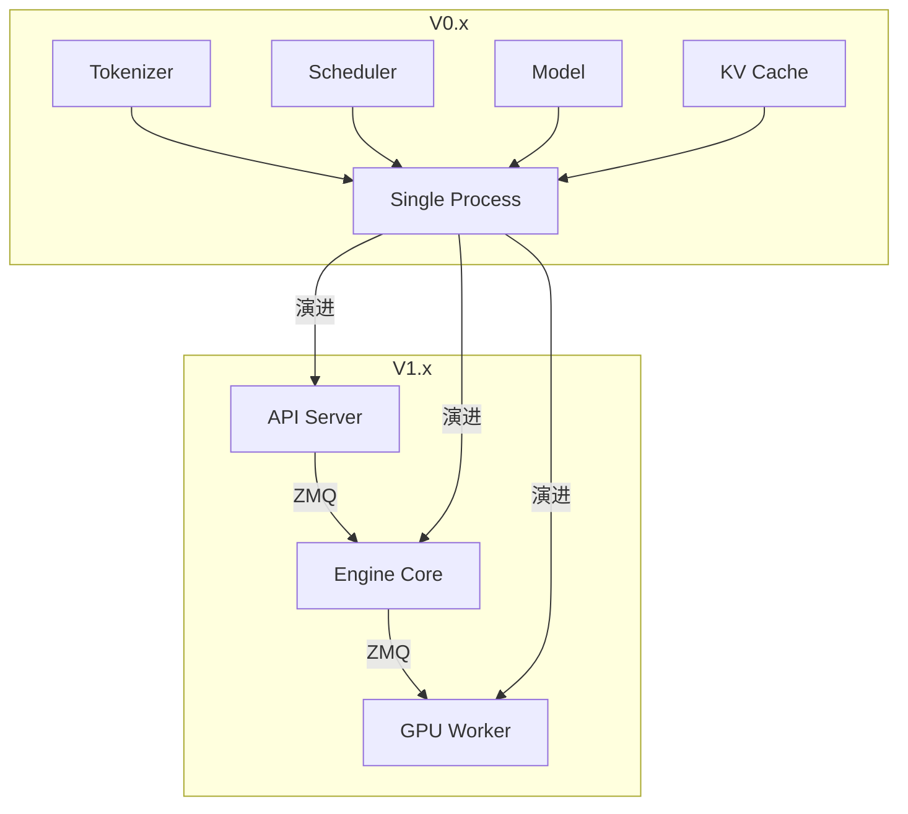

---

## 2. V1 架构全景图与设计理念

### 2.1 整体架构

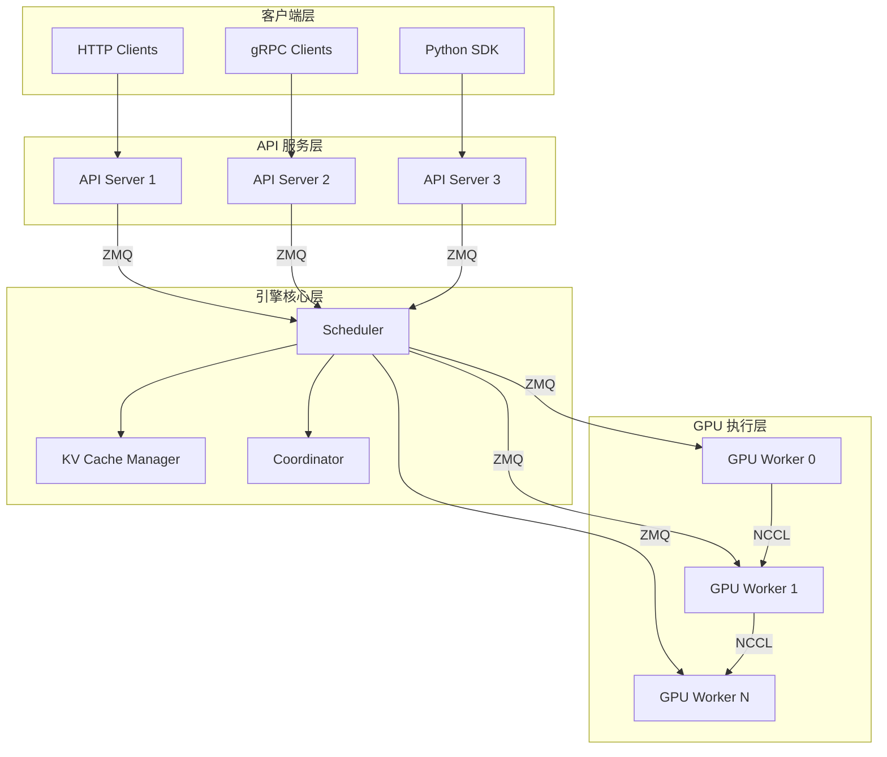

### 2.2 设计理念

**理念一：关注点分离**
- API Server：处理外部请求和协议转换
- Engine Core：调度和协调
- GPU Worker：执行模型推理

**理念二：异步通信**
- 使用 ZMQ 实现高效的进程间通信
- 支持高吞吐量和低延迟

**理念三：资源池化**
- KV Cache 预先分配，按需使用
- GPU 内存统一管理

### 2.3 架构分层职责

| 层级 | 职责 | 关键组件 |
|------|------|---------|
| **客户端层** | 接收外部请求 | HTTP/gRPC 接口 |
| **API 服务层** | Token 编解码、协议处理 | Tokenizer、OpenAI Server |
| **引擎核心层** | 请求调度、资源管理 | Scheduler、KV Cache Manager |
| **GPU 执行层** | 模型推理、计算执行 | Model Executor、GPU Cache |

---

## 3. 进程组成详解：各司其职

### 3.1 API Server 进程

**职责定位**：用户接触的第一层，处理外部请求

```python
class APIServer:
    def __init__(self, config: APIServerConfig):
        self.tokenizer = AutoTokenizer.from_pretrained(config.model_name)
        self.engine_client = AsyncEngineClient(config.engine_addr)
        self.openai_server = OpenAIServer(self)
    
    async def handle_request(self, request: InferenceRequest):
        # 1. Tokenization
        token_ids = self.tokenizer.encode(request.prompt)
        
        # 2. 构建请求
        vllm_request = VLLMRequest(
            prompt_token_ids=token_ids,
            sampling_params=request.sampling_params,
            lora_request=request.lora_request
        )
        
        # 3. 发送给引擎
        response = await self.engine_client.generate(vllm_request)
        
        # 4. Detokenization
        text = self.tokenizer.decode(response.output_token_ids)
        
        return InferenceResponse(text=text)
```

**关键功能**：
- **协议适配**：支持 OpenAI API、自定义 gRPC 协议
- **Token 处理**：文本与 token 的双向转换
- **请求路由**：将请求转发给 Engine Core

**为什么需要多个 API Server？**
- 充分利用多核 CPU 处理 tokenization
- 提高请求处理并发能力
- 实现负载均衡和高可用

### 3.2 Engine Core 进程

**职责定位**：整个系统的大脑，负责协调和调度

```python
class EngineCore:
    def __init__(self, config: EngineConfig):
        self.scheduler = Scheduler(config.scheduler_config)
        self.kv_cache_manager = KVCacheManager(config.cache_config)
        self.coordinator = Coordinator(config.distributed_config)
        self.gpu_workers = [GPUWorkerClient(i) for i in range(config.num_gpus)]
    
    async def schedule_step(self):
        # 1. 收集等待中的请求
        waiting_requests = self.scheduler.get_waiting_requests()
        
        # 2. 选择本轮执行的请求
        selected_requests = self.scheduler.select_requests(waiting_requests)
        
        # 3. 分配 KV Cache
        self.kv_cache_manager.allocate_slots(selected_requests)
        
        # 4. 发送给 GPU Workers
        await self._send_to_workers(selected_requests)
        
        # 5. 处理响应
        responses = await self._collect_responses()
        
        # 6. 更新状态
        self.scheduler.update_requests(responses)
```

**关键组件**：
- **Scheduler**：决定每轮执行哪些请求
- **KVCacheManager**：管理 KV Cache 的分配和释放
- **Coordinator**：协调分布式环境中的资源

**设计优势**：
- 调度逻辑独立，不受 GPU 计算阻塞
- 集中管理提高资源利用率
- 便于实现复杂调度算法

### 3.3 GPU Worker 进程

**职责定位**：真正执行模型推理的"工人"

```python
class GPUWorker:
    def __init__(self, worker_id: int, config: GPUWorkerConfig):
        self.worker_id = worker_id
        self.model_executor = ModelExecutor(config.model_config)
        self.gpu_cache = GPUCache(config.cache_config)
        self.rpc_server = ZMQServer(config.rpc_addr)
    
    async def execute_model(self, batch: ModelBatch):
        # 1. 准备输入
        input_ids = batch.input_ids
        kv_cache_slots = batch.kv_cache_slots
        
        # 2. 执行前向传播
        outputs = self.model_executor.forward(
            input_ids=input_ids,
            kv_cache_slots=kv_cache_slots
        )
        
        # 3. 更新 KV Cache
        self.gpu_cache.update(
            slots=kv_cache_slots,
            key=outputs.key,
            value=outputs.value
        )
        
        # 4. 返回结果
        return ModelOutput(
            output_ids=outputs.output_ids,
            logits=outputs.logits
        )
```

**关键功能**：
- **模型加载**：将模型权重加载到 GPU 显存
- **前向传播**：执行 Transformer 推理计算
- **内存管理**：管理 GPU 端的 KV Cache

**每个 GPU 对应一个 Worker**：
- 充分利用每个 GPU 的计算能力
- 便于实现张量并行
- 隔离不同 GPU 的内存空间

---

## 4. 进程间通信机制：高效协作

### 4.1 为什么选择 ZMQ？

| 通信方式 | 优点 | 缺点 |
|---------|------|------|
| **ZMQ** | 支持多种模式、高性能、异步 | 需要额外依赖 |
| **TCP/IP** | 跨机器通信 | 延迟较高 |
| **Unix Socket** | 低延迟 | 只能本机通信 |

**ZMQ 的优势**：
- **多种模式支持**：REQ/REP、DEALER/ROUTER、PUB/SUB
- **自动消息队列**：内置队列管理，无需手动实现
- **高吞吐量**：异步通信提高整体吞吐量
- **容错机制**：支持断线重连和消息持久化

### 4.2 通信架构

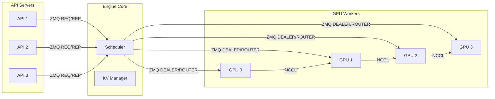

### 4.3 消息类型详解

```python
class MessageType(Enum):
    # API Server -> Engine Core
    ADD_REQUEST = 1
    CANCEL_REQUEST = 2
    GET_STATUS = 3
    
    # Engine Core -> GPU Worker
    EXECUTE_MODEL = 10
    ALLOCATE_SLOTS = 11
    FREE_SLOTS = 12
    
    # GPU Worker -> Engine Core
    MODEL_OUTPUT = 20
    WORKER_STATUS = 21
```

**消息流转示例**：

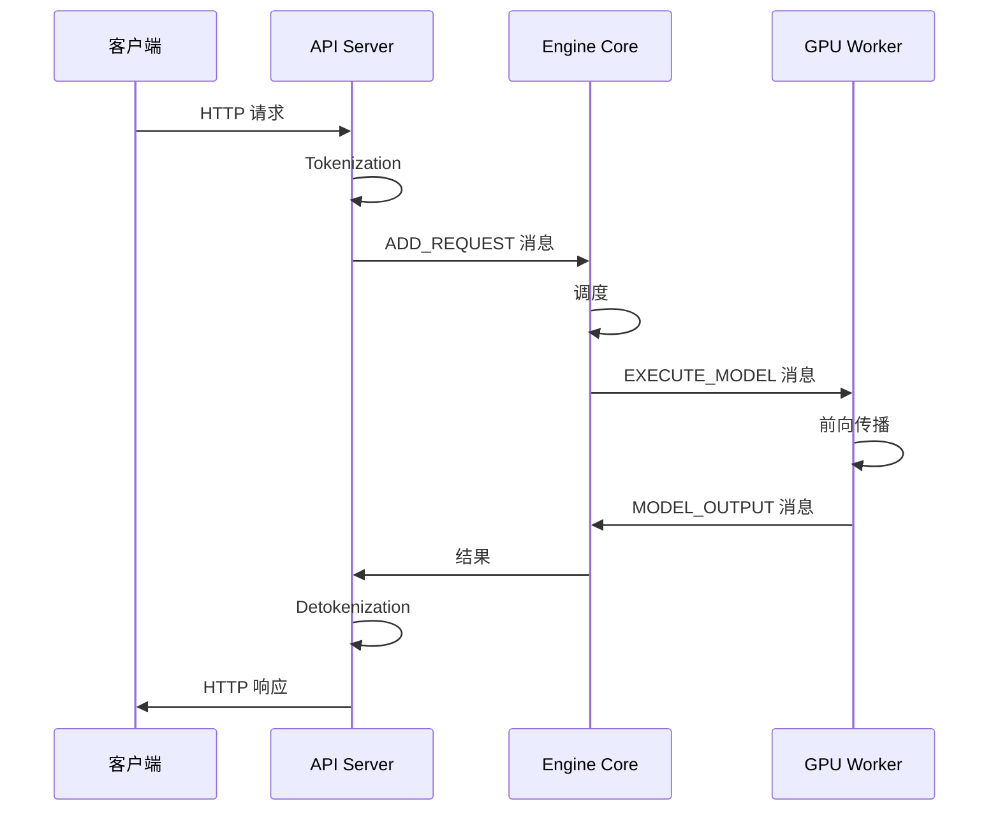

### 4.4 ZMQ 配置优化

```python
class ZMQConfig:
    recv_buffer_bytes: int = 100 * 1024 * 1024  # 100MB
    send_buffer_bytes: int = 100 * 1024 * 1024  # 100MB
    timeout_ms: int = 30000  # 30秒
    hwm: int = 1000  # 高水位线
```

**配置说明**：
- **缓冲区大小**：根据请求大小和吞吐量调整
- **超时设置**：防止请求无限等待
- **高水位线**：限制队列长度，防止内存爆炸

---

## 5. 调度器深度解析：智能决策

### 5.1 调度器的核心职责

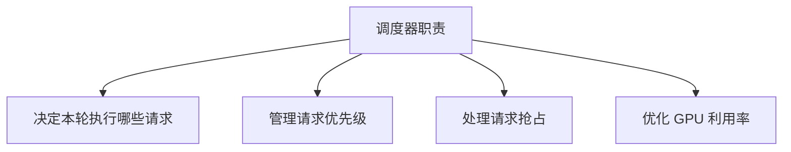

### 5.2 请求状态机

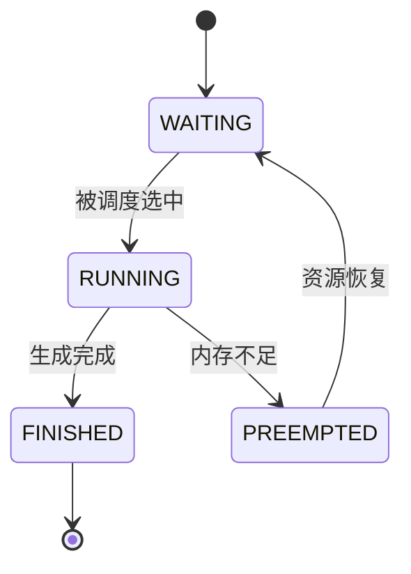

**状态说明**：
- **WAITING**：请求等待调度
- **RUNNING**：请求正在执行
- **PREEMPTED**：请求被抢占（内存不足）
- **FINISHED**：请求完成

### 5.3 Token 级调度：核心设计

**传统调度 vs Token 级调度**：

| 维度 | 传统调度 | Token 级调度 |
|------|---------|-------------|
| **调度粒度** | 请求级 | Token 级 |
| **阶段分离** | Prefill/Decode 分离 | 无分离 |
| **GPU 利用率** | 较低 | 接近 100% |
| **延迟** | 长请求阻塞短请求 | 短请求优先 |

**关键数据结构**：

```python
class Request:
    request_id: str
    prompt_token_ids: list[int]
    output_token_ids: list[int]
    num_computed_tokens: int  # 核心：统一追踪进度
    status: RequestStatus
    priority: int
```

**设计亮点**：
```python
# scheduler.py 中的注释
# There's no "decoding phase" nor "prefill phase" in the scheduler.
# Each request just has the num_computed_tokens.
# At each step, the scheduler tries to assign tokens to catch up.
```

### 5.4 调度流程

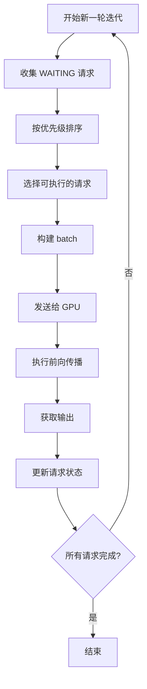

---

## 6. KV Cache 管理：内存优化核心

### 6.1 KV Cache 的重要性

**什么是 KV Cache？**
- 在 Transformer 中，每个 token 的注意力计算需要用到之前所有 token 的 Key 和 Value
- 缓存这些 Key 和 Value，避免重复计算

**性能提升**：
- 推理速度提升 10-20 倍
- 是长文本生成的关键技术

### 6.2 KV Cache 架构

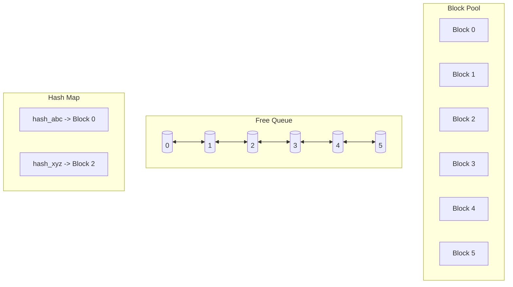

### 6.3 Block 数据结构

```python
@dataclass(slots=True)
class KVCacheBlock:
    block_id: int
    ref_cnt: int = 0
    block_hash: Optional[BlockHash] = None
    
    # 双向链表指针
    prev_free_block: Optional["KVCacheBlock"] = None
    next_free_block: Optional["KVCacheBlock"] = None
    
    is_null: bool = False
```

**设计亮点**：
- **预分配**：启动时创建所有 Block 对象
- **双向链表**：O(1) 队列操作
- **引用计数**：精确追踪使用情况

### 6.4 前缀缓存机制

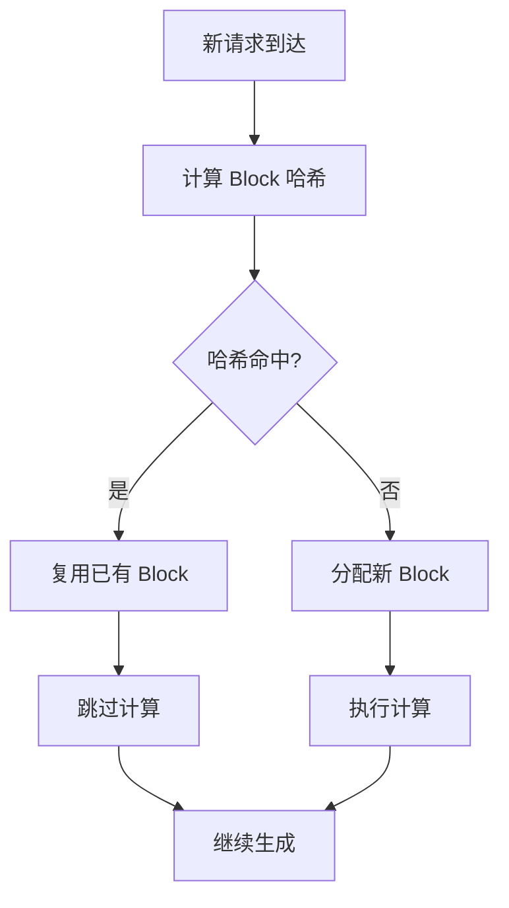

**链式哈希设计**：
```
Block 0: hash(NONE_HASH, tokens_0, extra_keys)
Block 1: hash(Block_0_hash, tokens_1, extra_keys)
Block 2: hash(Block_1_hash, tokens_2, extra_keys)
```

---

## 7. 请求完整生命周期：端到端流程

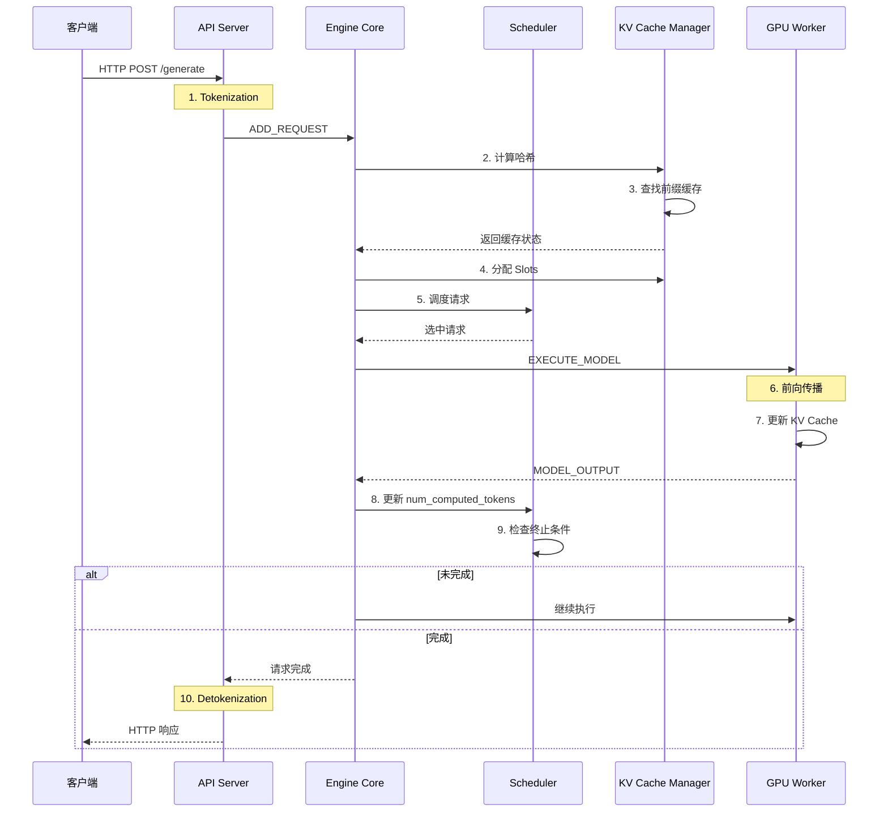

---

## 8. 分布式部署与并行策略

### 8.1 并行策略支持

| 策略 | 适用场景 | 配置方式 |
|------|---------|---------|
| **张量并行** | 大模型拆分 | `--tensor-parallel-size` |
| **流水线并行** | 超长模型 | `--pipeline-parallel-size` |
| **数据并行** | 提高吞吐量 | `--data-parallel-size` |
| **专家并行** | Mixture of Experts | `--expert-parallel-size` |

### 8.2 多节点部署

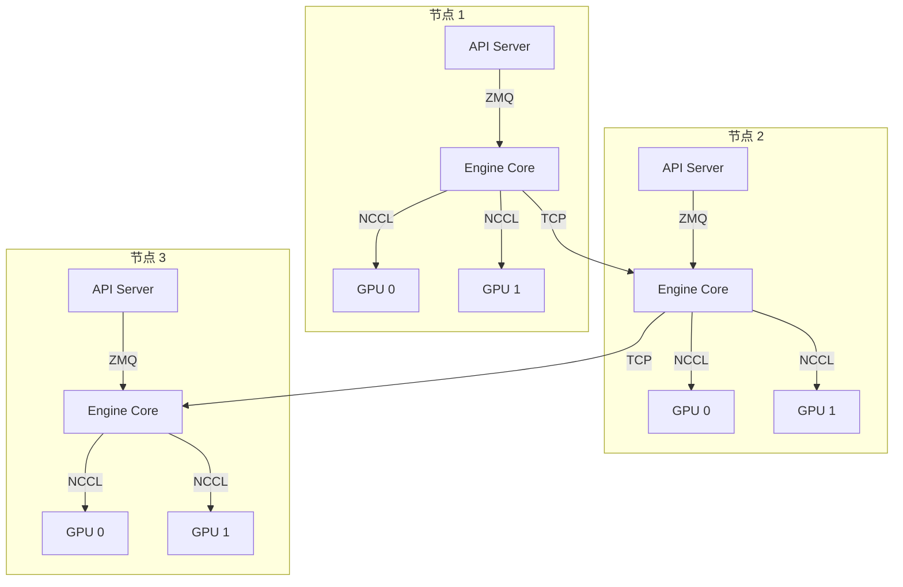

---

## 9. 生产环境最佳实践

### 9.1 配置建议

**基础配置**：
```bash
vllm serve meta-llama/Llama-3.2-3B-Instruct \
    --tensor-parallel-size 4 \
    --gpu-memory-utilization 0.9 \
    --max-num-batched-tokens 8192
```

**高可用配置**：
```bash
--enable-health-check \
--health-check-interval 10 \
--prometheus-port 9090
```

### 9.2 监控指标

| 指标 | 说明 |
|------|------|
| `vllm_requests_total` | 请求总数 |
| `vllm_request_latency_seconds` | 请求延迟 |
| `vllm_kv_cache_utilization` | KV Cache 利用率 |
| `vllm_gpu_memory_usage_bytes` | GPU 内存使用 |

---

## 参考资源

1. **vLLM 官方文档**：[架构概览](https://docs.vllm.ai/en/latest/design/arch_overview.html)
2. **vLLM 设计文档**：[V1 设计](https://docs.vllm.ai/en/latest/design/v1_design.html)
3. **vLLM GitHub**：[源码仓库](https://github.com/vllm-project/vllm)
4. **ZMQ 官方文档**：[ZeroMQ](https://zeromq.org/)
5. **NCCL 文档**：[NVIDIA NCCL](https://docs.nvidia.com/deeplearning/nccl/user-guide/docs/index.html)
