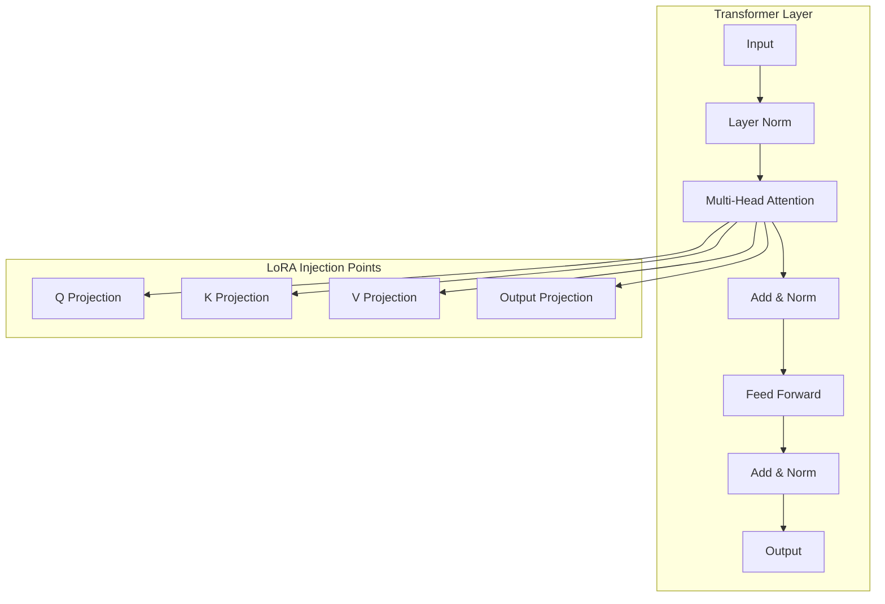
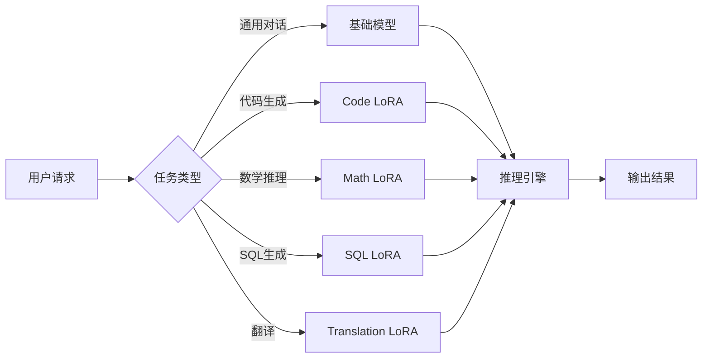
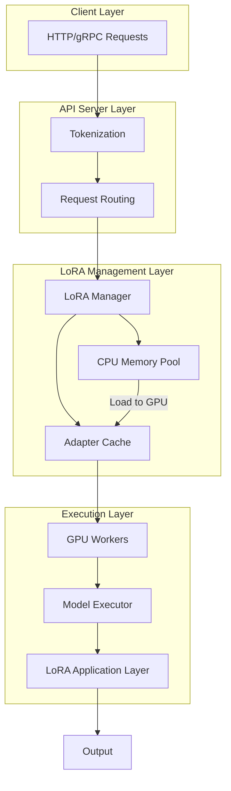
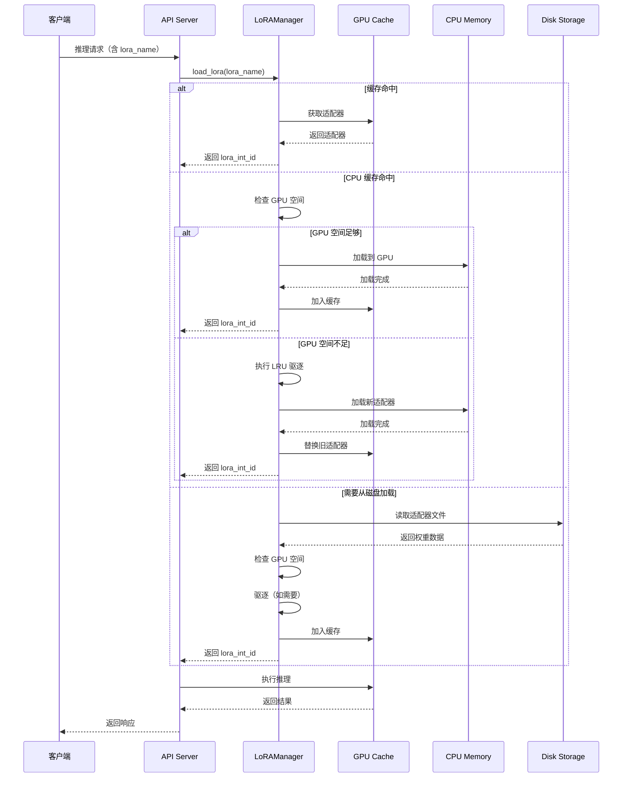
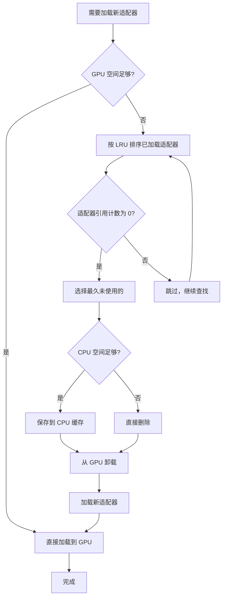
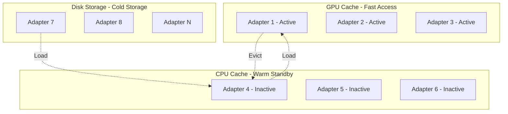
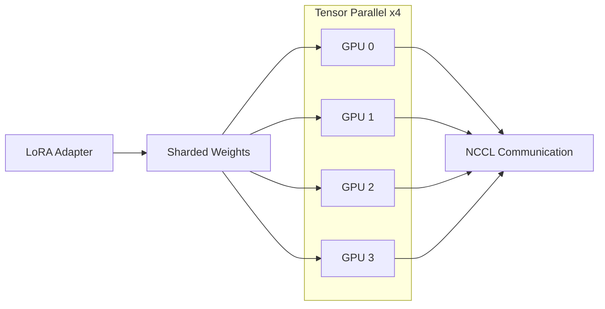
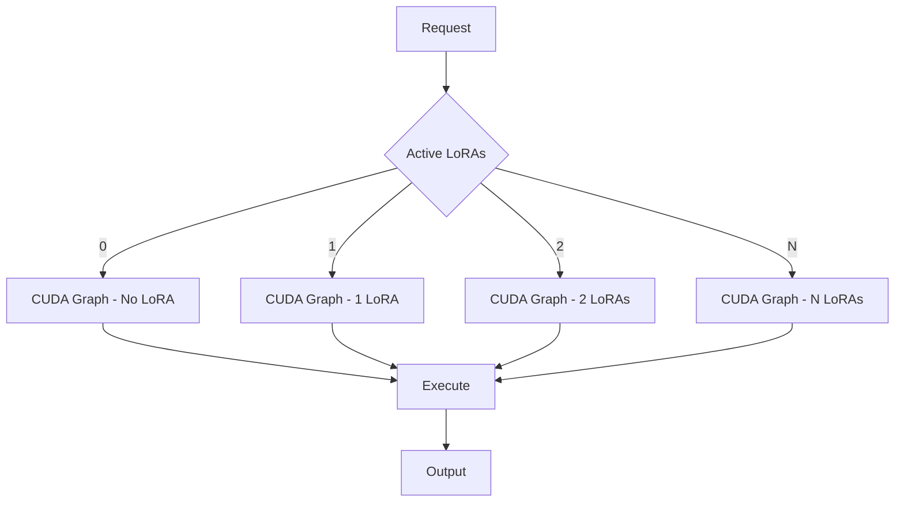
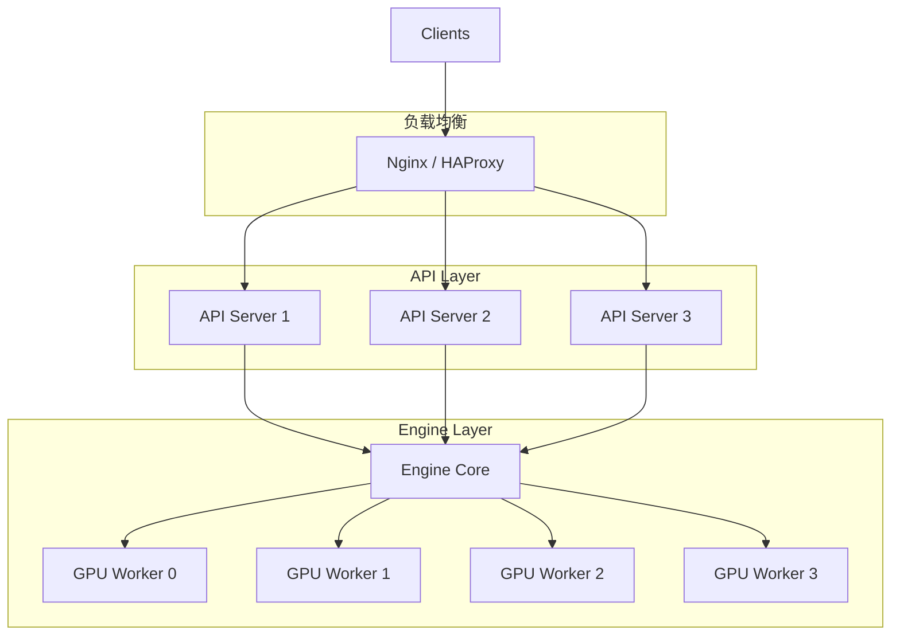

# vLLM LoRA 多适配器支持：动态加载与运行时配置

> 深入理解 vLLM 的 LoRA 动态加载机制：多适配器管理、运行时配置、内存优化与性能提升

---

## 目录

1. [LoRA 技术原理深度解析](#1-lora-技术原理深度解析)
2. [vLLM 多适配器支持的设计动机](#2-vllm-多适配器支持的设计动机)
3. [vLLM LoRA 架构设计详解](#3-vllm-lora-架构设计详解)
4. [动态加载机制的实现细节](#4-动态加载机制的实现细节)
5. [运行时配置与 API 接口](#5-运行时配置与-api-接口)
6. [内存管理策略与优化](#6-内存管理策略与优化)
7. [性能优化技术](#7-性能优化技术)
8. [生产环境部署实践](#8-生产环境部署实践)
9. [常见问题与最佳实践](#9-常见问题与最佳实践)

---

## 1. LoRA 技术原理深度解析

### 1.1 LoRA 核心思想

LoRA（Low-Rank Adaptation）是由 Microsoft 于 2021 年提出的高效模型微调技术，其核心创新在于**冻结预训练模型权重，仅通过注入低秩矩阵实现模型适配**。

**传统微调 vs LoRA：**

| 维度 | 传统全参数微调 | LoRA 微调 |
|------|---------------|-----------|
| 参数更新量 | 全部参数（~7B/13B/70B） | 仅低秩矩阵（< 1%） |
| 显存占用 | 高（需存储优化器状态） | 低（仅需存储适配器） |
| 训练速度 | 慢 | 快（数倍提升） |
| 多任务支持 | 差（需多个模型副本） | 优（共享基础模型） |

### 1.2 LoRA 数学原理

LoRA 的核心数学表达如下：

```
W' = W + α × A × B^T

其中：
- W ∈ R^(d_model × d_model) 是原始权重矩阵
- A ∈ R^(d_model × r) 是低秩矩阵（输入投影）
- B ∈ R^(r × d_model) 是低秩矩阵（输出投影）
- α 是缩放因子，通常设为 rank 值
- r 是秩（rank），通常取 8、16 或 32
```

**低秩分解的优势：**
- 当 d_model = 4096，r = 16 时，可训练参数从 16M 降至约 131K
- 参数减少约 99.2%，训练效率大幅提升

### 1.3 LoRA 在 Transformer 中的应用位置

LoRA 主要应用于 Transformer 的注意力层：



**典型配置：**
- 仅在 Q 和 V 投影层应用 LoRA（最常见）
- 或在 Q、K、V、Output 四层都应用

### 1.4 LoRA 权重合并策略

在推理时，有两种方式应用 LoRA：

**方式一：合并权重（Merge）**
```python
# 将 LoRA 权重合并到基础模型
merged_weight = base_weight + alpha * A @ B.T
```

**方式二：动态应用（Apply on-the-fly）**
```python
# 推理时动态应用 LoRA
output = base_weight @ x + alpha * (A @ (B @ x))
```

vLLM 采用方式二，支持动态切换适配器而无需重新加载模型。

---

## 2. vLLM 多适配器支持的设计动机

### 2.1 多任务场景的挑战

在实际生产环境中，LLM 服务需要支持多种任务：



**典型场景：**
- **企业 SaaS 平台**：为不同客户提供定制化模型
- **对话系统**：支持多场景切换（闲聊、客服、知识库）
- **多语言服务**：为每种语言训练专门的适配器

### 2.2 传统方案的局限性

**问题一：模型切换成本高**
- 每次切换任务需要重新加载整个模型（数十 GB）
- 加载时间长达数十秒甚至数分钟
- 用户体验差，无法实现实时切换

**问题二：资源浪费严重**
- 为每个任务维护完整模型副本
- 内存占用成倍增长
- 硬件成本高昂

**问题三：扩展困难**
- 新增任务需要重启服务
- 无法实现热更新
- 运维复杂度高

### 2.3 vLLM 多适配器方案的优势

vLLM 通过动态加载 LoRA 适配器解决了上述问题：

| 特性 | 说明 |
|------|------|
| **共享基础模型** | 所有适配器共享同一个基础模型权重，避免重复加载 |
| **动态加载** | 按需加载适配器，无需重启服务，实现热更新 |
| **内存优化** | 适配器可缓存到 CPU，GPU 只保留常用适配器 |
| **批处理支持** | 同一批次可包含不同适配器的请求，提高吞吐量 |
| **快速切换** | 适配器切换耗时仅数毫秒，用户无感知 |

---

## 3. vLLM LoRA 架构设计详解

### 3.1 整体架构



### 3.2 核心组件

#### 3.2.1 LoRAManager

**职责**：管理所有 LoRA 适配器的完整生命周期

```python
class LoRAManager:
    def __init__(self, config: LoRAConfig):
        self.max_loras = config.max_loras
        self.max_cpu_loras = config.max_cpu_loras
        self.lora_cache = {}  # lora_name -> LoRAAdapter
        self.cpu_loras = {}   # CPU 缓存的适配器
        self.lora_id_counter = 0
        self.lock = threading.Lock()
    
    def load_lora(self, lora_request: LoRARequest) -> int:
        """加载 LoRA 适配器，返回内部 ID"""
        # 1. 检查是否已加载
        # 2. 检查 GPU 缓存空间
        # 3. 驱逐旧适配器（如需要）
        # 4. 加载到 GPU
        # 5. 更新缓存
        pass
    
    def unload_lora(self, lora_name: str):
        """卸载 LoRA 适配器"""
        pass
    
    def get_lora(self, lora_name: str) -> Optional[LoRAAdapter]:
        """获取已加载的适配器"""
        pass
```

#### 3.2.2 LoRAAdapter

**职责**：封装单个 LoRA 适配器的状态和权重

```python
@dataclass
class LoRAAdapter:
    name: str                  # 适配器唯一名称
    path: str                  # 适配器文件路径
    rank: int                  # LoRA 秩
    dtype: torch.dtype         # 数据类型（FP16/BF16/FP8）
    weights: dict              # 权重字典 {module_name: weights}
    int_id: int                # 内部 ID（用于快速查找）
    ref_count: int = 0         # 引用计数
    loaded: bool = False       # 是否已加载到 GPU
    last_used_time: float = 0  # 最后使用时间（用于 LRU）
```

#### 3.2.3 LoRARequest

**职责**：表示一个使用 LoRA 的推理请求

```python
@dataclass
class LoRARequest:
    lora_name: str             # 适配器名称
    lora_int_id: int           # 内部 ID（由 LoRAManager 分配）
    lora_path: str = ""        # 适配器路径（首次加载时需要）
    base_model_name: str | None = None  # 基础模型名（可选）
    load_inplace: bool = False # 是否原地加载（不复制权重）
```

> **注**：缩放因子（scaling）不是 `LoRARequest` 的字段，而是在推理请求时通过 `extra_body` 传入（如 `"lora_scaling": 1.0`）。

### 3.3 配置参数详解

```python
class LoRAConfig:
    max_lora_rank: int = 16
    """最大支持的 LoRA rank，所有适配器的 rank 不能超过此值"""
    
    max_loras: int = 1
    """单个批次中最多支持的 LoRA 数量，决定了批处理能力"""
    
    fully_sharded_loras: bool = False
    """是否使用完全分片的 LoRA 计算，适用于张量并行场景"""
    
    max_cpu_loras: Optional[int] = None
    """CPU 内存中最多缓存的适配器数量，None 表示无限制"""
    
    lora_dtype: Union[torch.dtype, str] = "auto"
    """LoRA 适配器的数据类型，auto 表示与模型一致"""
    
    target_modules: Optional[List[str]] = None
    """限制 LoRA 应用到特定模块，如 ['q_proj', 'v_proj']"""
    
    enable_tower_connector_lora: bool = False
    """是否启用视觉塔（vision tower）的 LoRA 支持"""
    
    specialize_active_lora: bool = False
    """是否为不同数量的活动 LoRA 捕获独立的 CUDA graphs"""
```

---

## 4. 动态加载机制的实现细节

### 4.1 加载流程



### 4.2 驱逐策略

当 GPU 缓存空间不足时，vLLM 采用 **LRU（最近最少使用）** 策略：



**驱逐策略的设计考虑：**
- **引用计数优先**：正在使用的适配器不会被驱逐
- **LRU 顺序**：优先保留最近使用的适配器
- **CPU 缓存**：被驱逐的适配器可暂存到 CPU，加快再次加载

### 4.3 引用计数机制

```python
def touch_lora(self, lora_name: str):
    """增加引用计数，标记为正在使用"""
    with self.lock:
        if lora_name in self.lora_cache:
            self.lora_cache[lora_name].ref_count += 1
            self.lora_cache[lora_name].last_used_time = time.time()

def release_lora(self, lora_name: str):
    """减少引用计数"""
    with self.lock:
        if lora_name in self.lora_cache:
            self.lora_cache[lora_name].ref_count -= 1
            if self.lora_cache[lora_name].ref_count == 0:
                # 标记为可驱逐
                pass
```

**引用计数的作用：**
- 防止正在使用的适配器被意外驱逐
- 支持并发请求共享同一适配器
- 实现细粒度的资源管理

---

## 5. 运行时配置与 API 接口

### 5.1 启用运行时 LoRA 更新

**环境变量配置：**
```bash
# 启用运行时 LoRA 动态加载
export VLLM_ALLOW_RUNTIME_LORA_UPDATING=True
```

**启动参数配置：**
```bash
vllm serve meta-llama/Llama-3.2-3B-Instruct \
    --enable-lora \
    --max-loras 4 \
    --max-lora-rank 64 \
    --lora-dtype bf16 \
    --max-cpu-loras 10
```

### 5.2 API 接口

#### 5.2.1 加载适配器

```bash
POST /v1/load_lora_adapter

{
    "lora_name": "sql_adapter",
    "lora_path": "/path/to/sql_lora_adapter"
}

# 响应
{
    "status": "success",
    "lora_name": "sql_adapter",
    "lora_int_id": 1,
    "rank": 16,
    "dtype": "bf16"
}
```

#### 5.2.2 卸载适配器

```bash
POST /v1/unload_lora_adapter

{
    "lora_name": "sql_adapter"
}

# 响应
{
    "status": "success",
    "message": "Adapter sql_adapter unloaded successfully"
}
```

#### 5.2.3 列出已加载的适配器

> **注**：截至当前版本，vLLM 尚未实现 `/v1/list_lora_adapters` 端点。如需查询已加载的适配器，可通过 vLLM 的 Prometheus metrics 或日志观察。

### 5.3 使用适配器进行推理

**OpenAI 兼容 API：**
```python
from openai import OpenAI

client = OpenAI(base_url="http://localhost:8000/v1", api_key="dummy")

response = client.chat.completions.create(
    model="meta-llama/Llama-3.2-3B-Instruct",
    messages=[{"role": "user", "content": "Generate a SQL query to get user statistics"}],
    extra_body={
        "lora_name": "sql_adapter",
        "lora_scaling": 1.0
    }
)
```

**Python SDK：**
```python
from vllm import LLM, SamplingParams
from vllm.lora.request import LoRARequest

llm = LLM(
    model="meta-llama/Llama-3.2-3B-Instruct",
    enable_lora=True,
    max_loras=4
)

sampling_params = SamplingParams(temperature=0.7, max_tokens=100)

# 使用 LoRA 适配器
outputs = llm.generate(
    "Translate this sentence to French: Hello world",
    sampling_params,
    lora_request=LoRARequest("translation_fr", 1, "/path/to/fr_adapter")
)
```

---

## 6. 内存管理策略与优化

### 6.1 两级缓存设计



**缓存层级说明：**

| 层级 | 存储位置 | 访问速度 | 容量 | 用途 |
|------|---------|---------|------|------|
| GPU Cache | GPU 显存 | 最快 | 小（数 GB） | 正在使用或高频使用的适配器 |
| CPU Cache | CPU 内存 | 中等 | 较大（数十 GB） | 近期使用过的适配器 |
| Disk | 磁盘 | 最慢 | 最大 | 所有适配器的持久化存储 |

### 6.2 内存估算

| 模型大小 | LoRA Rank | Adapter Size (FP16) | Adapter Size (BF16) |
|---------|----------|---------------------|---------------------|
| 7B | 8 | ~10 MB | ~10 MB |
| 7B | 16 | ~20 MB | ~20 MB |
| 7B | 32 | ~40 MB | ~40 MB |
| 13B | 8 | ~20 MB | ~20 MB |
| 13B | 16 | ~40 MB | ~40 MB |
| 70B | 8 | ~100 MB | ~100 MB |
| 70B | 16 | ~200 MB | ~200 MB |

**计算公式：**
```
Adapter Size ≈ 2 × num_layers × rank × hidden_size × dtype_size

其中：
- num_layers: Transformer 层数（如 7B 约 32 层）
- rank: LoRA 秩（如 8、16、32）
- hidden_size: 隐藏层维度（如 4096）
- dtype_size: 数据类型大小（FP16/BF16 为 2 字节）
```

### 6.3 内存优化策略

**策略一：限制同时加载的适配器数量**
```bash
--max-loras 4  # GPU 最多同时加载 4 个适配器
```

**策略二：设置 CPU 缓存上限**
```bash
--max-cpu-loras 10  # CPU 最多缓存 10 个适配器
```

**策略三：使用更紧凑的数据类型**
```bash
--lora-dtype bf16  # 使用 BF16 减少内存占用
```

**策略四：预加载常用适配器**
```python
# 启动时预加载
llm = LLM(
    model="meta-llama/Llama-3.2-3B-Instruct",
    enable_lora=True,
    preload_loras=["sql_adapter", "code_adapter"]
)
```

---

## 7. 性能优化技术

### 7.1 完全分片 LoRA

```python
fully_sharded_loras: bool = False
```

**适用场景**：张量并行（Tensor Parallelism）部署



**优势**：
- 减少单个 GPU 的内存压力
- 支持更大模型的 LoRA 推理
- 提高整体吞吐量

### 7.2 CUDA Graph 优化

```python
specialize_active_lora: bool = False
```

**工作原理**：为不同数量的活动 LoRA 捕获独立的 CUDA graphs



**优势**：
- 减少 CUDA kernel 启动开销
- 提高推理速度约 10-20%
- 适合高吞吐量场景

### 7.3 数据类型优化

| 数据类型 | 内存占用 | 性能 | 适用场景 |
|---------|---------|------|---------|
| FP32 | 最大 | 最慢 | 需要最高精度 |
| FP16 | 小（50%） | 快 | 通用场景 |
| BF16 | 小（50%） | 快 | NVIDIA Ampere+ GPU |
| FP8 | 最小（25%） | 最快 | NVIDIA Hopper GPU |

**推荐配置**：
- **训练阶段**：FP16 或 BF16
- **推理阶段**：BF16（推荐）或 FP8（如果支持）

### 7.4 批量推理优化

vLLM 支持同一批次包含不同 LoRA 适配器的请求：

```python
# 批量请求示例
prompts = [
    {"text": "Generate SQL query", "lora": "sql_adapter"},
    {"text": "Write Python code", "lora": "code_adapter"},
    {"text": "Explain physics", "lora": None}  # 不使用 LoRA
]

# 处理批量请求
results = llm.generate(
    [p["text"] for p in prompts],
    sampling_params,
    lora_requests=[
        LoRARequest(p["lora"], i, f"/path/to/{p['lora']}") 
        if p["lora"] else None 
        for i, p in enumerate(prompts)
    ]
)
```

---

## 8. 生产环境部署实践

### 8.1 部署架构



### 8.2 配置建议

**基础配置：**
```bash
vllm serve meta-llama/Llama-3.2-3B-Instruct \
    --enable-lora \
    --max-loras 4 \
    --max-lora-rank 64 \
    --lora-dtype bf16 \
    --max-cpu-loras 10 \
    --tensor-parallel-size 4 \
    --gpu-memory-utilization 0.9
```

**高可用配置：**
```bash
# 启用健康检查
--enable-health-check \
--health-check-interval 10 \
--health-check-timeout 5

# 启用指标监控
--prometheus-port 9090 \
--metrics-port 8080
```

### 8.3 监控与可观测性

**关键指标：**
| 指标 | 说明 | 监控目的 |
|------|------|---------|
| lora_adapters_loaded | 当前加载的适配器数量 | 资源使用情况 |
| lora_adapters_cpu_cached | CPU 缓存的适配器数量 | 缓存效率 |
| lora_load_latency_ms | 适配器加载延迟 | 性能监控 |
| lora_eviction_count | 适配器驱逐次数 | 缓存策略优化 |
| lora_requests_total | LoRA 请求总数 | 业务量统计 |

**Prometheus 示例：**
```yaml
# 监控规则
groups:
  - name: lora_rules
    rules:
      - record: lora_adapters_utilization
        expr: lora_adapters_loaded / max_loras
      - record: lora_cache_hit_rate
        expr: lora_cache_hits / (lora_cache_hits + lora_cache_misses)
```

---

## 9. 常见问题与最佳实践

### 9.1 常见问题

**问题一：适配器加载失败**
```
Error: Failed to load LoRA adapter: CUDA out of memory
```
**解决方案**：
- 减少 `--max-loras` 参数
- 使用更小的 rank 值
- 清理不需要的适配器

**问题二：推理结果不符合预期**
```
现象：使用 LoRA 后输出质量下降
```
**解决方案**：
- 检查缩放因子是否正确
- 验证适配器文件路径
- 确保适配器与基础模型兼容

**问题三：适配器切换不生效**
```
现象：切换适配器后输出没有变化
```
**解决方案**：
- 检查 `lora_name` 是否正确
- 确认适配器已成功加载
- 验证请求中的 `lora_int_id`

### 9.2 最佳实践

**实践一：合理设置缓存大小**
```bash
# 根据 GPU 显存大小调整
# 对于 24GB GPU，建议 max-loras=4-8
--max-loras 4
```

**实践二：预加载常用适配器**
```python
# 启动时预加载高频使用的适配器
preload_loras=["sql_adapter", "code_adapter"]
```

**实践三：监控缓存命中率**
```python
# 定期检查缓存命中率
hit_rate = cache_hits / (cache_hits + cache_misses)
if hit_rate < 0.8:
    # 增加 CPU 缓存大小
    adjust_max_cpu_loras(new_value)
```

**实践四：使用版本控制**
```python
# 为适配器添加版本号
lora_name = "sql_adapter_v2"
```

---

## 参考资源

1. **vLLM 官方文档**：[LoRA 支持文档](https://docs.vllm.ai/en/latest/models/lora.html)
2. **LoRA 论文**：[LoRA: Low-Rank Adaptation of Large Language Models](https://arxiv.org/abs/2106.09685)
3. **vLLM 配置指南**：[LoRAConfig 配置](https://docs.vllm.ai/en/latest/config.html#loraconfig)
4. **腾讯云技术博客**：[vLLM 多租户 LoRA 原理揭秘](https://cloud.tencent.com/developer/article/2552601)
5. **CSDN 技术博客**：[vLLM 革新 LoRA 适配器切换效率](https://blog.csdn.net/XianxinMao/article/details/145654800)
6. **vLLM GitHub 仓库**：[vLLM 源码](https://github.com/vllm-project/vllm)
