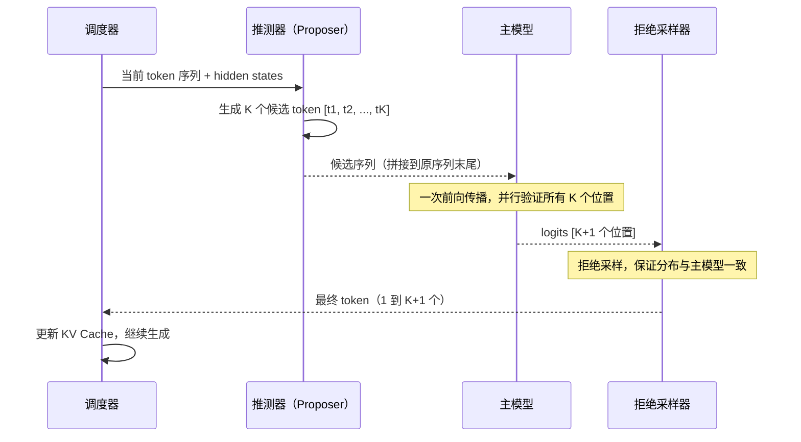
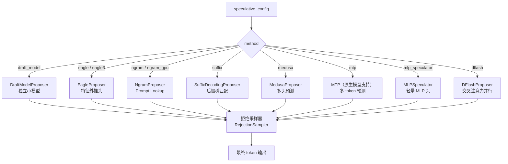
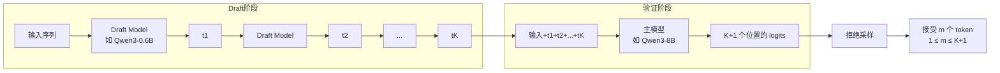
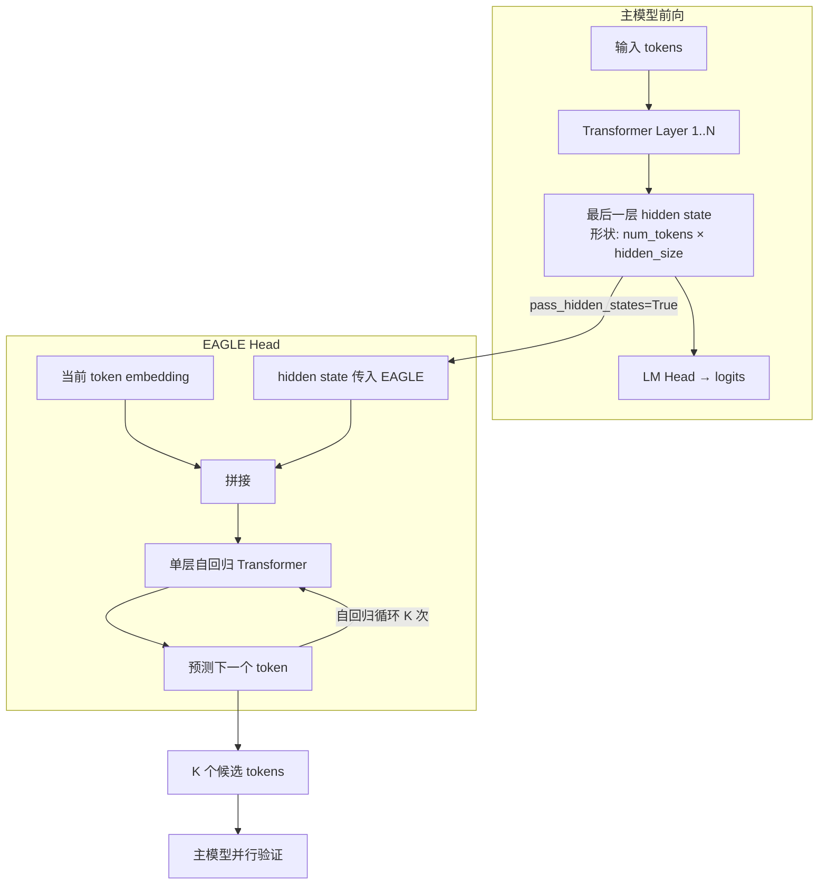
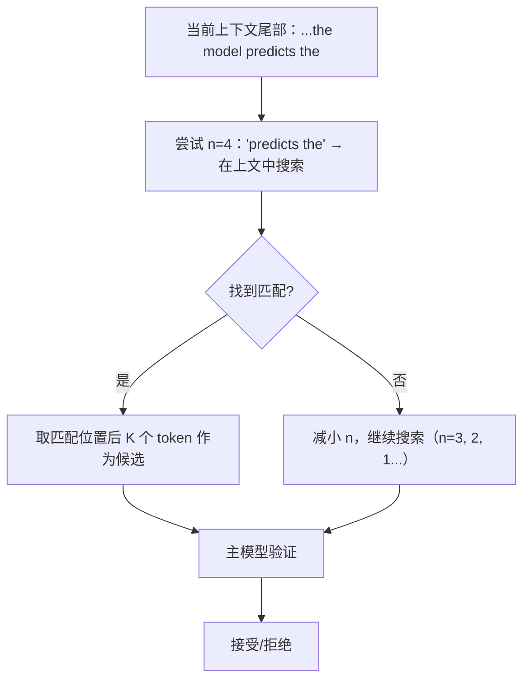
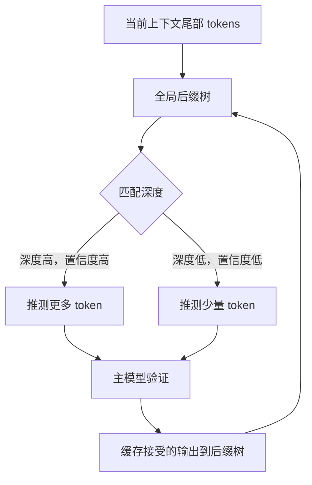
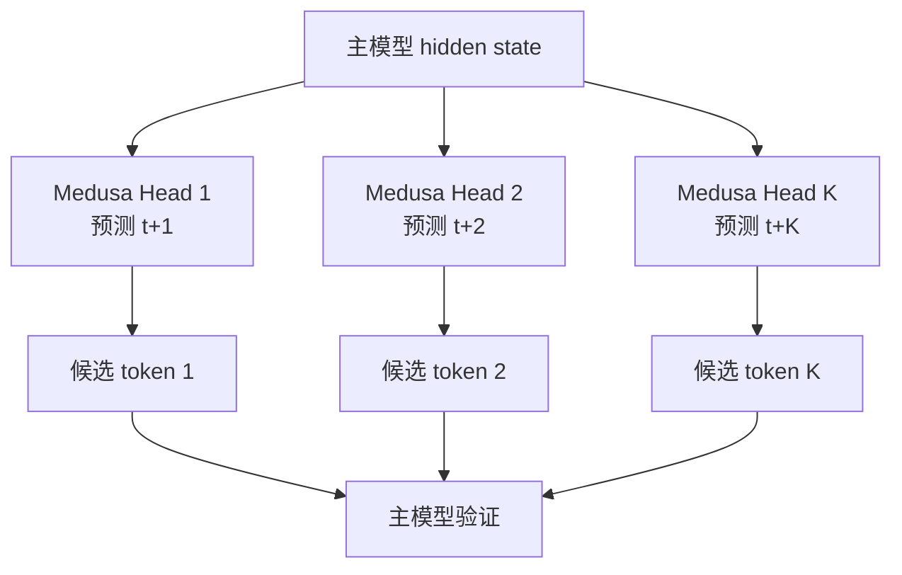
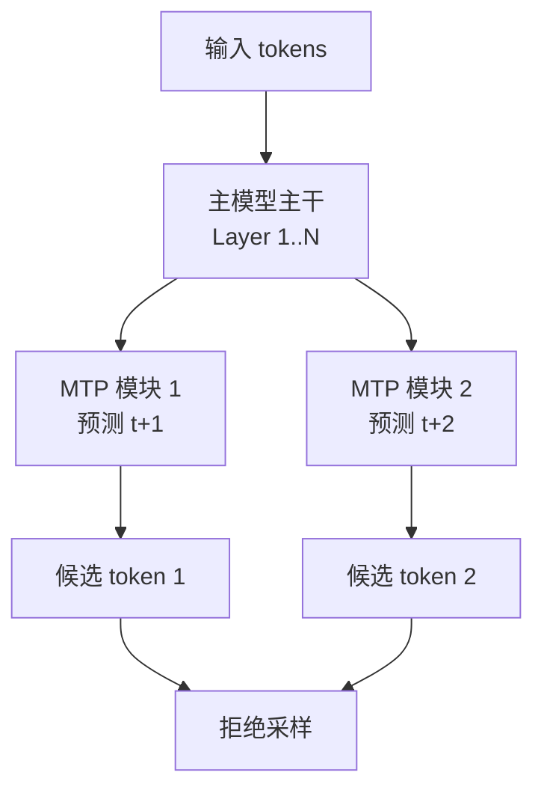
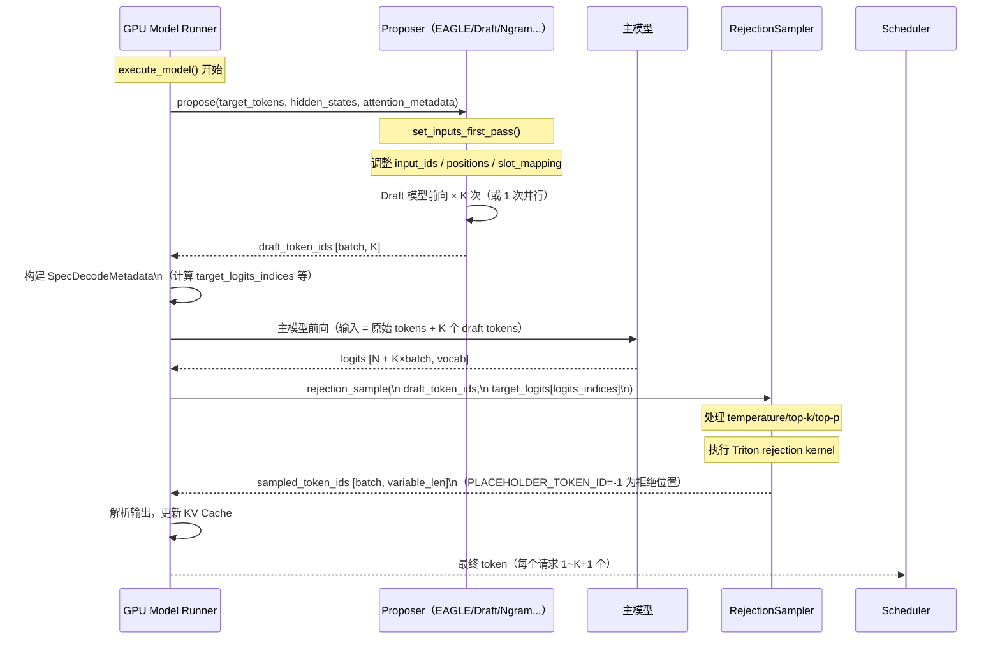
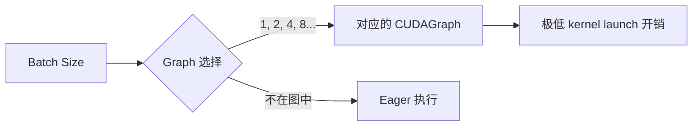

# vLLM Speculative Decoding：推测解码深度解析

> 深入理解 vLLM 的推测解码技术：原理、所有方法的实现细节、拒绝采样算法、性能优化与调优实践

---

## 目录

1. [推测解码的核心思想](#1-推测解码的核心思想)
2. [vLLM 支持的推测方法总览](#2-vllm-支持的推测方法总览)
3. [Draft Model 推测解码](#3-draft-model-推测解码)
4. [EAGLE 推测解码](#4-eagle-推测解码)
5. [Ngram 推测解码（Prompt Lookup Decoding）](#5-ngram-推测解码prompt-lookup-decoding)
6. [Suffix Decoding（后缀树推测）](#6-suffix-decoding后缀树推测)
7. [Medusa 推测解码](#7-medusa-推测解码)
8. [MTP（Multi-Token Prediction）](#8-mtpmulti-token-prediction)
9. [拒绝采样：理论与实现](#9-拒绝采样理论与实现)
10. [vLLM 实现架构深度解析](#10-vllm-实现架构深度解析)
11. [性能优化与调优](#11-性能优化与调优)
12. [监控指标](#12-监控指标)
13. [使用示例与最佳实践](#13-使用示例与最佳实践)

---

## 1. 推测解码的核心思想

### 1.1 为什么需要推测解码？

大语言模型在推理时面临严重的 **内存带宽瓶颈（Memory-Bandwidth Bound）**。自回归生成每步只产出一个 token，整个前向传播的大量算力用于加载权重，而非真正的矩阵运算，导致 GPU 计算单元大量空闲。

**三个核心问题**：

| 问题 | 本质原因 | 影响 |
|------|---------|------|
| 低 GPU 利用率 | Decode 阶段 batch size = 1，矩阵退化为向量乘法 | 算力浪费 > 90% |
| 高延迟 | N 个 token 需要 N 次串行前向传播 | 首 token 后每步等待 |
| 内存带宽压力 | 每次前向都要从 HBM 加载全部权重 | 带宽成为唯一瓶颈 |

推测解码的核心洞察：**验证比生成快得多**。将多个位置的 token 同时送入 Transformer 做并行验证，虽然每次前向的计算量略有增加，但 GPU 的矩阵并行计算能力得到充分利用，整体吞吐大幅提升。

### 1.2 推测解码的数学基础

设主模型目标分布为 $q(x)$，draft 模型分布为 $p(x)$，每轮推测 $K$ 个 token。

**拒绝采样（Rejection Sampling）**保证输出分布与主模型完全一致：

对于每个位置 $i$，以概率 $\min\left(1, \frac{q(x_i)}{p(x_i)}\right)$ 接受 draft token $x_i$；
若拒绝，从调整后的分布 $\text{norm}(\max(0, q - p))$ 中重新采样。

**期望接受 token 数**（DeepMind 论文证明）：

$$\mathbb{E}[\text{accepted tokens}] = \frac{K \cdot \alpha}{1 - \alpha^K} \cdot (1 - \alpha)$$

其中 $\alpha = \sum_x \min(p(x), q(x))$ 为单步接受概率。

实际加速比与 $\alpha$、$K$、主模型/draft 模型速度之比有关：

```
实际加速比 = (1 + K·α) / (1 + K · t_draft/t_target)
```

当 $t_{draft} \ll t_{target}$（draft 远快于主模型）且 $\alpha$ 较高时，加速比接近理论上限 $1 + K \cdot \alpha$。

### 1.3 推测解码的工作流程



**关键：** 无论接受几个 token，输出分布都**严格等于**只用主模型生成的分布，这是推测解码"无损"的理论保证。

---

## 2. vLLM 支持的推测方法总览

vLLM v1 在 `vllm/v1/spec_decode/` 下实现了多种推测方法，统一通过 `--speculative-config` 配置：



### 方法选择速查表

| 方法 | 低 QPS（延迟优先） | 高 QPS（吞吐优先） | 额外依赖 | 适用场景 |
|------|:-----------------:|:-----------------:|---------|---------|
| **EAGLE / EAGLE3** | ★★★★★ | ★★★★ | 专用 EAGLE head | 通用，首选 |
| **MTP** | ★★★★★ | ★★★★ | 原生模型支持 | DeepSeek / Qwen3 等 |
| **Draft Model** | ★★★★ | ★★★ | 独立 draft 模型 | 通用 |
| **DFlash（PARD）** | ★★★★ | ★★★★ | 专用模型 | Qwen3 并行加速 |
| **Medusa** | ★★★ | ★★★ | Medusa head | 简单部署 |
| **MLP Speculator** | ★★★ | ★★★ | 兼容 MLP head | 有现成 MLP head 时 |
| **Ngram** | ★★ | ★★★ | 无 | 摘要/翻译/代码补全 |
| **Suffix Decoding** | ★★ | ★★★ | arctic_inference | 重复性代码/agentic 循环 |

---

## 3. Draft Model 推测解码

### 3.1 基本原理

使用一个独立的小语言模型作为 Draft Model，快速预测 K 个候选 token，再交由主模型并行验证。



**关键约束**：Draft Model 与主模型的**词表大小必须完全一致**，否则拒绝采样无法进行概率比较。

### 3.2 vLLM 中的 DraftModelProposer

源码位于 `vllm/v1/spec_decode/draft_model.py`，核心特点：

```python
class DraftModelProposer(SpecDecodeBaseProposer):
    def __init__(self, vllm_config, device, runner=None):
        super().__init__(
            vllm_config=vllm_config,
            device=device,
            pass_hidden_states_to_model=False,  # 不接收主模型 hidden states
            runner=runner,
        )
        self._raise_if_vocab_size_mismatch()   # 严格检查词表一致性
        self._raise_if_draft_tp_mismatch()     # 检查 TP 大小一致性

    def _create_draft_vllm_config(self) -> VllmConfig:
        # Draft model 使用独立的 parallel config
        # 支持单独设置 draft_tensor_parallel_size
        return replace(
            base,
            quant_config=None,
            parallel_config=replace(
                spec.draft_parallel_config,
                rank=self.vllm_config.parallel_config.rank,
            ),
            model_config=spec.draft_model_config,
        )

    # Draft model 不与主模型共享 embeddings 或 lm_head
    def _maybe_share_embeddings(self, target): pass
    def _maybe_share_lm_head(self, target): pass
```

**与 EAGLE 的关键区别**：
- `pass_hidden_states_to_model=False`：Draft model 独立前向，不接收主模型的隐藏状态
- embeddings 和 lm_head 完全独立，不与主模型共享
- 需要 TP 大小一致（draft 的 TP 必须等于主模型 TP）

### 3.3 使用示例

```python
from vllm import LLM, SamplingParams

llm = LLM(
    model="Qwen/Qwen3-8B",
    speculative_config={
        "method": "draft_model",
        "model": "Qwen/Qwen3-0.6B",
        "num_speculative_tokens": 5,
    },
)

sampling_params = SamplingParams(temperature=0.8, top_p=0.95)
outputs = llm.generate(["The future of AI is"], sampling_params)
```

**CLI：**
```bash
vllm serve Qwen/Qwen3-8B \
    --speculative-config '{"method": "draft_model", "model": "Qwen/Qwen3-0.6B", "num_speculative_tokens": 5}'
```

### 3.4 并行 Draft（PARD）

vLLM 还支持 **Parallel Draft Model（PARD）**，一次前向传播同时生成所有 K 个 draft token，而非串行生成：

```bash
vllm serve meta-llama/Meta-Llama-3-70B-Instruct \
    --speculative-config '{
        "method": "draft_model",
        "model": "meta-llama/Meta-Llama-3-8B-Instruct",
        "num_speculative_tokens": 5,
        "parallel_drafting": true
    }'
```

**适用条件**：Draft model 需要经过专门训练以支持并行预测（非所有模型天然支持）。

---

## 4. EAGLE 推测解码

### 4.1 EAGLE 原理

EAGLE（**Extrapolation Algorithm for Greater Language-model Efficiency**）的核心思想：不使用独立的小语言模型，而是训练一个轻量的**自回归特征外推头（EAGLE head）**，该头接收主模型最后一层的隐藏状态，预测下一步 token。

**论文**：[EAGLE: Extrapolation Algorithm for Greater Language-model Efficiency](https://arxiv.org/pdf/2401.15077)



**EAGLE head 的输入**：`[token_embedding, hidden_state]` 的拼接，这使得 EAGLE head 能同时感知 token 身份和主模型的语义理解，预测质量远高于独立的小模型。

### 4.2 EAGLE vs EAGLE3

| 特性 | EAGLE（v1） | EAGLE3（v3） |
|------|------------|-------------|
| **使用的 hidden states** | 最后一层 | 多层融合（aux hidden states） |
| **method 参数值** | `"eagle"` | `"eagle3"` |
| **模型示例** | `yuhuili/EAGLE-LLaMA3-Instruct-8B` | `RedHatAI/Llama-3.1-8B-Instruct-speculator.eagle3` |
| **配置字段** | 标准 | `extract_hidden_states` 辅助层 |
| **性能** | 好 | 更强，尤其是高 QPS 场景 |

EAGLE3 在主模型前向传播时，会额外从多个中间层提取 hidden states，通过 `extract_hidden_states.py` 中的 `ExtractHiddenStatesProposer` 实现，然后将多层特征融合后传入 EAGLE3 head。

### 4.3 vLLM 中的 EagleProposer

```python
# vllm/v1/spec_decode/eagle.py
class EagleProposer(SpecDecodeBaseProposer):
    def __init__(self, vllm_config, device, runner=None):
        super().__init__(
            vllm_config,
            device,
            pass_hidden_states_to_model=True,  # ← 与 DraftModel 的核心区别
            runner=runner,
        )
```

`pass_hidden_states_to_model=True` 触发基类中的一系列逻辑：
- 主模型前向时，最后一层 hidden states 被截获并传递给 EAGLE head
- EAGLE head 的输入是 `[embedding, hidden_state]` 的拼接
- EAGLE head 通常**共享主模型的 embeddings 和 lm_head**（降低内存，提升预测质量）

### 4.4 权重共享机制

```python
# llm_base_proposer.py 中的共享逻辑（简化）
def _maybe_share_embeddings(self, target_language_model):
    # EAGLE head 通常省略 embedding 层，共享主模型的
    if draft_embed_weight is None:
        draft_model.embed_tokens = target_model.embed_tokens

def _maybe_share_lm_head(self, target_language_model):
    # EAGLE head 通常省略 lm_head，共享主模型的
    if weight_identical(draft_lm_head, target_lm_head):
        draft_model.lm_head = target_model.lm_head
```

这是 EAGLE 内存占用远低于完整 Draft Model 的关键原因。

### 4.5 使用示例

```python
from vllm import LLM, SamplingParams

# EAGLE
llm = LLM(
    model="meta-llama/Meta-Llama-3-8B-Instruct",
    tensor_parallel_size=4,
    speculative_config={
        "method": "eagle",
        "model": "yuhuili/EAGLE-LLaMA3-Instruct-8B",
        "draft_tensor_parallel_size": 1,
        "num_speculative_tokens": 3,
    },
)

# EAGLE3
llm3 = LLM(
    model="meta-llama/Meta-Llama-3-8B-Instruct",
    tensor_parallel_size=2,
    speculative_config={
        "method": "eagle3",
        "model": "RedHatAI/Llama-3.1-8B-Instruct-speculator.eagle3",
        "draft_tensor_parallel_size": 2,
        "num_speculative_tokens": 3,
    },
)
```

**可用的 EAGLE head 模型**（HuggingFace Hub）：
- [RedHatAI/speculator-models](https://huggingface.co/collections/RedHatAI/speculator-models)
- [yuhuili 的 EAGLE 系列](https://huggingface.co/yuhuili/models?search=eagle)

---

## 5. Ngram 推测解码（Prompt Lookup Decoding）

### 5.1 原理：Prompt Lookup Decoding

vLLM 的 Ngram 推测解码本质是 **Prompt Lookup Decoding**（[原始讨论](https://x.com/joao_gante/status/1747322413006643259)），**不需要任何预训练模型**。

**核心逻辑**：在当前请求的上下文（prompt + 已生成内容）中，查找与末尾 n 个 token 相同的历史片段，将其后续 token 作为推测候选。



**适用场景**：文档摘要（输出复述原文）、代码补全（填充与 prompt 相近的模式）、翻译（目标语言复用原文结构）等。

### 5.2 CPU 实现（Numba JIT）

源码：`vllm/v1/spec_decode/ngram_proposer.py`

```python
class NgramProposer:
    def __init__(self, vllm_config):
        self.min_n = spec_config.prompt_lookup_min    # 最小 n-gram 长度
        self.max_n = spec_config.prompt_lookup_max    # 最大 n-gram 长度
        self.k = spec_config.num_speculative_tokens   # 候选 token 数

        # Numba JIT 预编译（首次约 < 1 秒）
        self.propose(...)  # 触发预热编译

    def batch_propose(self, num_requests, valid_ngram_requests,
                      num_tokens_no_spec, token_ids_cpu):
        """
        多线程批量推测（总 token 数 > 8192 时启用多线程）
        pre-allocated buffers: valid_ngram_draft[num_seqs, k]
        """
        total_tokens = sum(num_tokens_no_spec[:num_requests])
        if total_tokens > self.num_tokens_threshold:
            set_num_threads(self.num_numba_thread_available)
        # 使用 Numba JIT 并行执行 n-gram 匹配
```

核心算法使用 **最长前缀匹配（KMP 变体）**，从最大 n 开始依次尝试，找到的第一个有效匹配即返回。

### 5.3 GPU 实现（向量化 Tensor 操作）

源码：`vllm/v1/spec_decode/ngram_proposer_gpu.py`

GPU 版本使用 `torch.unfold` 生成所有滑动窗口，批量向量化查找，比 CPU 版更适合大 batch 场景：

```python
class NgramGPUKernel(nn.Module):
    @support_torch_compile()
    def forward(self, token_ids, num_tokens):
        # 1. 提取末尾 n-gram 作为查询
        suffix = token_ids[:, -ngram_len:]           # [batch, ngram_len]

        # 2. 生成所有滑动窗口
        windows = token_ids.unfold(-1, ngram_len, 1) # [batch, L, ngram_len]

        # 3. 向量化比较（找最早的匹配位置）
        matches = (windows == suffix.unsqueeze(1)).all(-1)  # [batch, L]

        # 4. 取最早匹配后的 K 个 token
        match_pos = matches.long().argmax(dim=-1)
        draft_tokens = token_ids.gather(...)
```

**method 值**：CPU 用 `"ngram"`，GPU 用 `"ngram_gpu"`。

### 5.4 使用示例

```python
from vllm import LLM, SamplingParams

llm = LLM(
    model="Qwen/Qwen3-8B",
    speculative_config={
        "method": "ngram",          # 或 "ngram_gpu" 使用 GPU 版本
        "num_speculative_tokens": 5,
        "prompt_lookup_max": 4,     # 最大 n-gram 窗口大小
        "prompt_lookup_min": 2,     # 最小 n-gram 窗口大小（可选，默认 1）
    },
)
```

**CLI：**
```bash
vllm serve Qwen/Qwen3-8B \
    --speculative-config '{"method": "ngram", "num_speculative_tokens": 5, "prompt_lookup_max": 4}'
```

---

## 6. Suffix Decoding（后缀树推测）

### 6.1 原理

Suffix Decoding 使用**后缀树（Suffix Tree）**对请求历史进行模式匹配，支持**动态调整每步推测数量**。

与 Ngram 的区别：
- Ngram 只在当前 prompt 内查找；Suffix Decoding 在**全局请求缓存**中查找
- Ngram 每步推测固定 K 个 token；Suffix Decoding 根据匹配置信度**动态决定推测深度**
- 特别适合**重复性高**的场景：agentic 循环、RL rollout、代码编辑



**依赖**：需要安装 `arctic-inference` 库（来自 [Snowflake/Arctic](https://github.com/Snowflake-Labs/arctic-inference)）：

```bash
pip install arctic-inference
```

### 6.2 关键配置参数

| 参数 | 含义 | 默认值 |
|------|------|--------|
| `suffix_decoding_max_tree_depth` | 最大前缀匹配 + 推测树深度 | 24 |
| `suffix_decoding_max_cached_requests` | 全局后缀树缓存的最大请求数 | 10000 |
| `suffix_decoding_max_spec_factor` | 推测长度上限 = 该系数 × 前缀匹配长度 | 1.0 |
| `suffix_decoding_min_token_prob` | 推测一个 token 所需的最低估计概率 | 0.1 |

### 6.3 使用示例

```python
from vllm import LLM, SamplingParams

llm = LLM(
    model="Qwen/Qwen3-8B",
    speculative_config={
        "method": "suffix",
        "num_speculative_tokens": 8,
        "suffix_decoding_max_tree_depth": 24,
        "suffix_decoding_max_cached_requests": 10000,
        "suffix_decoding_max_spec_factor": 1.0,
        "suffix_decoding_min_token_prob": 0.1,
    },
)
```

**CLI：**
```bash
vllm serve Qwen/Qwen3-8B \
    --speculative-config '{
        "method": "suffix",
        "num_speculative_tokens": 8,
        "suffix_decoding_max_tree_depth": 24,
        "suffix_decoding_max_cached_requests": 10000
    }'
```

---

## 7. Medusa 推测解码

### 7.1 原理

Medusa 使用一个带**多个预测头（Multi-Head）**的 draft 模型，每个头负责预测未来的一个 token 位置。与 EAGLE 不同，Medusa head 的各个头之间是**独立并行**的，而非自回归。



### 7.2 实现细节

源码：`vllm/v1/spec_decode/medusa.py`

```python
# 核心逻辑（简化）
class MedusaProposer:
    def propose(self, target_hidden_states, ...):
        # Medusa head 以主模型的 hidden states 作为输入
        blocks = self.model(target_hidden_states)
        logits = self.model.compute_logits(blocks)

        # 每个头独立 argmax，得到 K 个 draft token
        draft_tokens = torch.stack(
            [logit.argmax(dim=-1) for logit in logits],
            dim=1
        )  # 形状: [batch_size, num_heads]
        return draft_tokens
```

**特点**：
- 单次前向即可得到 K 个候选 token（并行，非自回归）
- 预测质量随 token 位置增大而下降（各头独立，无序列依赖）
- 不支持 Expert Parallelism with EPLB

### 7.3 使用示例

```bash
vllm serve <target-model> \
    --speculative-config '{"method": "medusa", "model": "<medusa-head-model>", "num_speculative_tokens": 3}'
```

---

## 8. MTP（Multi-Token Prediction）

### 8.1 原理

MTP 是指**模型原生支持多 token 预测**的推测解码方式，代表模型为 DeepSeek-V3、DeepSeek-R1、Qwen3 等。

与其他方法的区别：**无需额外加载 draft model**，主模型本身包含 MTP 模块（通常是额外的 Transformer 层），在训练时就以多 token 预测为目标之一进行优化。



### 8.2 支持 MTP 的模型类型

vLLM 识别的 MTP 模型类型（`vllm/config/speculative.py`）：

```python
MTPModelTypes = Literal[
    "deepseek_mtp",       # DeepSeek-V3 / R1
    "mimo_mtp",           # MiMo 系列
    "glm4_moe_mtp",       # GLM4 MoE
    "qwen3_next_mtp",     # Qwen3 系列
    "gemma4_mtp",         # Gemma 4（使用 assistant checkpoint）
    # ... 更多
]
```

### 8.3 使用示例

**DeepSeek-V3 / R1：**
```python
from vllm import LLM, SamplingParams

llm = LLM(
    model="deepseek-ai/DeepSeek-V3",
    speculative_config={
        "method": "mtp",
        "num_speculative_tokens": 1,  # DeepSeek-V3 默认 1 个 MTP token
    },
    tensor_parallel_size=8,
)
```

**Gemma 4（使用 assistant checkpoint）：**
```python
llm = LLM(
    model="google/gemma-4-27b-it",
    speculative_config={
        "method": "mtp",
        "model": "google/gemma-4-27b-it-assistant",  # assistant checkpoint
    },
)
```

> ⚠️ 注意：如果使用旧版 vLLM 对 Gemma 4 的 assistant checkpoint 配置 `method="draft_model"`，会看到警告，应升级到支持 Gemma 4 MTP 的版本并使用 `method="mtp"`。

---

## 9. 拒绝采样：理论与实现

### 9.1 为什么需要拒绝采样？

推测解码的"无损"保证来自拒绝采样（Rejection Sampling）。若直接使用 draft model 的 argmax token，输出分布会偏向 draft model 而非目标主模型。拒绝采样通过数学上严格的接受/拒绝机制，保证最终输出分布与仅使用主模型生成的分布完全一致。

### 9.2 算法流程

源码：`vllm/v1/sample/rejection_sampler.py`

```mermaid
flowchart TD
    A[draft_tokens: K 个推测 token\ntarget_logits: 主模型在 K+1 个位置的 logits] --> B[处理 target logits\n应用 temperature/top-k/top-p/penalties]
    B --> C{采样方式}
    C -->|全部贪婪 greedy| D[rejection_greedy_sample_kernel\n比较 argmax(target) == draft_token]
    C -->|含随机 random| E[rejection_random_sample_kernel\n计算 p_target / p_draft，随机接受]
    D --> F{第 i 个被拒绝}
    E --> F
    F -->|未被拒绝| G[接受该 token，继续下一个位置]
    F -->|被拒绝| H[从 norm(max(0, q-p)) 重新采样 recovered token\n立即终止后续位置的验证]
    G --> I{是否全部接受?}
    I -->|是| J[从 target 分布额外采样 1 个 bonus token]
    I -->|否| K[输出到此为止]
    H --> K
    J --> K
    K --> L[输出: 1 到 K+1 个 token]
```

### 9.3 Triton Kernel 实现

**贪婪路径（`rejection_greedy_sample_kernel`）：**
```
对每个请求 r，对每个位置 i：
  if draft_token[i] == argmax(target_logits[i]):
    accepted[i] = draft_token[i]
    继续下一个位置
  else:
    accepted[i] = argmax(target_logits[i])  # 直接取主模型的 token
    将后续所有位置标记为 PLACEHOLDER_TOKEN_ID (-1)
    break
若全部接受：额外采样 bonus token 并附加
```

**随机路径（`rejection_random_sample_kernel`）：**
```
对每个请求 r，对每个位置 i：
  p_target = softmax(target_logits[i])[draft_token[i]]
  p_draft  = softmax(draft_logits[i])[draft_token[i]]
  u ~ Uniform[0, 1]
  if u < min(1, p_target / p_draft):
    accepted[i] = draft_token[i]
  else:
    # 从调整分布重采样：norm(max(0, target_prob - draft_prob))
    accepted[i] = sample_recovered_token(target_logits[i], draft_logits[i])
    将后续位置标记为 PLACEHOLDER_TOKEN_ID
    break
若全部接受：额外采样 bonus token（来自最后一个位置的 target logits）
```

**recovered token 采样（`sample_recovered_tokens_kernel`）：**
使用 **Gumbel-Max trick** 高效采样：
```
adjusted = target_prob - draft_prob
adjusted = max(0, adjusted) / sum(max(0, adjusted))  # 归一化
sampled = argmax(adjusted / (-log(uniform)))           # Gumbel-Max
```

### 9.4 Synthetic 拒绝采样模式

除标准拒绝采样外，vLLM 还支持 **Synthetic 模式**：用预定义的、单调递减的接受率序列替代逐位置的概率计算，适合需要固定接受率分布的场景（如基准测试、研究）。

```python
speculative_config={
    "method": "draft_model",
    "model": "Qwen/Qwen3-0.6B",
    "num_speculative_tokens": 5,
    "rejection_sample_method": "synthetic",
    "synthetic_acceptance_length": 3.5,  # 目标平均接受长度
}
```

实现原理：将无条件接受率序列 $[r_0, r_1, ..., r_{K-1}]$ 转换为条件接受率：
$$c_i = r_i / r_{i-1}$$
这样可以实现早终止的拒绝循环，与标准拒绝采样在统计特性上等价。

---

## 10. vLLM 实现架构深度解析

### 10.1 核心数据结构

#### SpecDecodeMetadata（`vllm/v1/spec_decode/metadata.py`）

```python
@dataclass
class SpecDecodeMetadata:
    # 所有请求的 draft token IDs（展平）
    draft_token_ids: torch.Tensor    # shape: [total_draft_tokens]

    # 每个请求的 draft token 数量
    num_draft_tokens: list[int]      # length: batch_size

    # 以下为 GPU tensor，用于 Triton kernel 高效索引
    cu_num_draft_tokens: torch.Tensor   # 累积和，shape: [batch_size]
    cu_num_sampled_tokens: torch.Tensor # 累积采样数，shape: [batch_size]

    # logits 索引：决定从主模型 logits 的哪些行提取用于验证
    target_logits_indices: torch.Tensor  # 验证 draft token 的 logits 行
    bonus_logits_indices: torch.Tensor   # 额外采样 bonus token 的 logits 行
    logits_indices: torch.Tensor         # 两者合并（target + bonus）

    @property
    def max_spec_len(self) -> int:
        return max(self.num_draft_tokens)
```

### 10.2 完整执行流程



### 10.3 Proposer 基类架构

所有推测方法（EAGLE、Draft Model）都继承自 `SpecDecodeBaseProposer`（`vllm/v1/spec_decode/llm_base_proposer.py`，约 1638 行）：

```
SpecDecodeBaseProposer
├── 状态管理
│   ├── input_ids buffer          [max_num_tokens]
│   ├── positions buffer          [max_positions]
│   ├── hidden_states buffer      [max_num_tokens, hidden_size]
│   ├── is_rejected_token_mask    [max_num_tokens]  ← Padded drafter 专用
│   └── is_masked_token_mask      [max_num_tokens]  ← Parallel drafting 专用
│
├── 核心方法
│   ├── propose()                 ← 主入口：生成 K 个 draft tokens
│   ├── set_inputs_first_pass()   ← 准备第一步的输入
│   ├── build_per_group_and_layer_attn_metadata()  ← 构建 draft 注意力元数据
│   └── _determine_batch_execution_and_padding()   ← CUDAGraph 调度
│
├── 权重共享
│   ├── _maybe_share_embeddings()  ← EAGLE 共享，DraftModel 不共享
│   └── _maybe_share_lm_head()     ← EAGLE 共享，DraftModel 不共享
│
└── 优化
    ├── use_local_argmax_reduction  ← TP vocab 并行优化
    ├── parallel_drafting           ← 并行生成所有 K token
    └── CUDAGraph dispatch          ← PIECEWISE cudagraph 支持
```

### 10.4 KV Cache 管理：Padded Drafter Batch

推测解码面临的一个难题：当 draft token 被拒绝后，KV Cache 中的对应 slot 需要被正确处理。

vLLM 使用 **Padded Drafter Batch** 策略：

```
第 t 轮：draft tokens = [A, B, C, D, E]
         主模型验证：A✓, B✓, C✗ → 接受 A, B，拒绝 C, D, E

第 t+1 轮准备：
  ┌─────────────────────────────────────────────┐
  │ 有效 token: [..., A, B, next_token]          │
  │ 被拒绝的 slot: 标记为 PADDING_SLOT_ID = -1  │
  │ → 这些位置参与注意力计算但不写入 KV Cache    │
  └─────────────────────────────────────────────┘
```

核心 Triton kernel（`copy_and_expand_eagle_inputs_kernel`）在一次 kernel 调用中完成：
- 有效 token 的 input_ids 拷贝
- positions 重新计算
- 被拒绝位置的 rejection mask 设置
- slot_mapping 重新映射（PADDING_SLOT_ID 标记无效 slot）

### 10.5 Triton Kernel 总览

| Kernel | 功能 | 所在文件 |
|--------|------|---------|
| `eagle_step_slot_mapping_metadata_kernel` | 单步更新 positions / slot_mapping / seq_lens | utils.py |
| `copy_and_expand_eagle_inputs_kernel` | 扩展 Padded Drafter Batch 输入 | utils.py |
| `eagle_prepare_inputs_padded_kernel` | 计算 token_indices_to_sample / num_rejected | utils.py |
| `eagle_prepare_next_token_padded_kernel` | 找下一步的有效 token（处理 Padded 路径） | utils.py |
| `rejection_greedy_sample_kernel` | 贪婪路径拒绝采样 | rejection_sampler.py |
| `rejection_random_sample_kernel` | 随机路径拒绝采样 | rejection_sampler.py |
| `sample_recovered_tokens_kernel` | Gumbel-Max recovered token 采样 | rejection_sampler.py |
| `copy_and_expand_dflash_inputs_kernel` | DFlash 模式的输入扩展 | utils.py |

---

## 11. 性能优化与调优

### 11.1 关键优化：Local Argmax Reduction

在 Tensor Parallelism 场景下，通常需要 all-gather 全部 vocab_size 的 logits 才能做 argmax。vLLM 的 `use_local_argmax_reduction` 优化将通信量从 $O(\text{vocab\_size})$ 降至 $O(2 \times \text{tp\_size})$：

```python
speculative_config={
    "method": "draft_model",
    "model": "...",
    "num_speculative_tokens": 5,
    "use_local_argmax_reduction": True,  # TP 场景下的 vocab 并行优化
}
```

**原理**：各 TP rank 分别对本地 vocab 分片求 argmax，再 all-reduce 取全局最大值，通信量降低约 vocab_size / (2 × tp_size) 倍。

### 11.2 CUDAGraph 支持

EAGLE 方法支持 **PIECEWISE CUDAGraph** 模式：



PIECEWISE 模式下：
- 推测循环的每一步单独 capture 为一个图
- 不同 batch size 对应不同图（padding 到 2 的幂次）
- 推测 token 数变化时动态选择图

### 11.3 num_speculative_tokens 调优

**黄金区间**：接受率 70%-90% 对应最佳性价比。

```python
# 监控接受率后动态调整
# vLLM Prometheus 指标（PromQL 示例）：
# 接受率 = rate(vllm:spec_decode_num_accepted_tokens[1m])
#          / rate(vllm:spec_decode_num_draft_tokens[1m])

# 通用起点建议：
num_speculative_tokens = {
    "小模型 (<10B)": 3,
    "中模型 (10B-50B)": 5,
    "大模型 (>50B)": 3,   # draft 开销更大，宜保守
}
```

### 11.4 何时不适合推测解码

推测解码在以下场景**收益有限甚至为负**：

| 场景 | 原因 | 建议 |
|------|------|------|
| 高 QPS 满载 | GPU 已满负荷，引入 draft 增加内存压力 | 关闭推测解码 |
| 随机温度高（temperature > 1.0） | 接受率低，draft 频繁被拒绝 | 降低 num_speculative_tokens |
| Prefill 占主导的长 prompt 场景 | 推测只在 decode 阶段生效 | 优先优化 prefill |
| 极短输出（< 10 tokens） | 摊销不了 draft 的开销 | 不使用推测解码 |

### 11.5 配合量化使用

```bash
# 主模型 FP8 量化，draft model 不量化（保证接受率）
vllm serve meta-llama/Meta-Llama-3-70B-Instruct \
    --quantization fp8 \
    --speculative-config '{
        "method": "draft_model",
        "model": "meta-llama/Meta-Llama-3-8B-Instruct",
        "num_speculative_tokens": 5
    }'

# 若 draft model 也需要量化（内存非常紧张时）：
# 使用 speculative_config 中的 quantization 字段单独配置
```

---

## 12. 监控指标

### 12.1 vLLM 暴露的 Prometheus 指标

源码：`vllm/v1/spec_decode/metrics.py`

| 指标名 | 类型 | 含义 |
|--------|------|------|
| `vllm:spec_decode_num_drafts` | Counter | 推测批次总数 |
| `vllm:spec_decode_num_draft_tokens` | Counter | 总推测 token 数 |
| `vllm:spec_decode_num_accepted_tokens` | Counter | 总接受 token 数 |
| `vllm:spec_decode_num_accepted_tokens_per_pos` | Counter（向量） | 各位置的接受次数 |

### 12.2 关键指标计算

```python
# 接受率（越高越好，目标 70-90%）
acceptance_rate = num_accepted_tokens / num_draft_tokens

# 平均接受长度（包括 bonus token，理论最大值 = K+1）
mean_acceptance_length = 1 + (num_accepted_tokens / num_drafts)

# 各位置接受率（观察衰减趋势）
per_pos_rate = num_accepted_tokens_per_pos[i] / num_drafts

# PromQL 查询示例：
# rate(vllm:spec_decode_num_accepted_tokens[5m])
#   / rate(vllm:spec_decode_num_draft_tokens[5m])
```

### 12.3 基准测试脚本

vLLM 官方提供了完整的基准测试脚本（`examples/features/speculative_decoding/spec_decode_offline.py`）：

```python
# 运行基准测试，输出逐位置接受率
python examples/features/speculative_decoding/spec_decode_offline.py \
    --model Qwen/Qwen3-8B \
    --speculative-method eagle \
    --speculative-model yuhuili/EAGLE-LLaMA3-Instruct-8B \
    --num-speculative-tokens 5 \
    --num-prompts 100
```

输出示例：
```
Mean acceptance length: 3.8
Per-position acceptance rate:
  pos 0: 92.3%
  pos 1: 85.1%
  pos 2: 74.6%
  pos 3: 61.2%
  pos 4: 48.9%
```

---

## 13. 使用示例与最佳实践

### 13.1 完整配置速查

```python
from vllm import LLM, SamplingParams

# ── Draft Model ──────────────────────────────────────
llm = LLM(
    model="Qwen/Qwen3-8B",
    speculative_config={
        "method": "draft_model",
        "model": "Qwen/Qwen3-0.6B",
        "num_speculative_tokens": 5,
        # 可选：
        # "draft_tensor_parallel_size": 1,
        # "parallel_drafting": False,
        # "use_local_argmax_reduction": False,
    },
)

# ── EAGLE ─────────────────────────────────────────────
llm = LLM(
    model="meta-llama/Meta-Llama-3-8B-Instruct",
    speculative_config={
        "method": "eagle",
        "model": "yuhuili/EAGLE-LLaMA3-Instruct-8B",
        "num_speculative_tokens": 3,
        "draft_tensor_parallel_size": 1,
    },
)

# ── EAGLE3 ────────────────────────────────────────────
llm = LLM(
    model="meta-llama/Meta-Llama-3-8B-Instruct",
    speculative_config={
        "method": "eagle3",
        "model": "RedHatAI/Llama-3.1-8B-Instruct-speculator.eagle3",
        "num_speculative_tokens": 3,
    },
)

# ── Ngram（CPU）───────────────────────────────────────
llm = LLM(
    model="Qwen/Qwen3-8B",
    speculative_config={
        "method": "ngram",
        "num_speculative_tokens": 5,
        "prompt_lookup_max": 4,
        "prompt_lookup_min": 2,  # 可选，默认 1
    },
)

# ── Ngram（GPU 加速）──────────────────────────────────
llm = LLM(
    model="Qwen/Qwen3-8B",
    speculative_config={
        "method": "ngram_gpu",
        "num_speculative_tokens": 5,
        "prompt_lookup_max": 4,
    },
)

# ── Suffix Decoding ───────────────────────────────────
llm = LLM(
    model="Qwen/Qwen3-8B",
    speculative_config={
        "method": "suffix",
        "num_speculative_tokens": 8,
        "suffix_decoding_max_tree_depth": 24,
        "suffix_decoding_max_cached_requests": 10000,
    },
)

# ── MTP（DeepSeek-V3）─────────────────────────────────
llm = LLM(
    model="deepseek-ai/DeepSeek-V3",
    speculative_config={
        "method": "mtp",
        "num_speculative_tokens": 1,
    },
    tensor_parallel_size=8,
)
```

### 13.2 CLI 命令速查

```bash
# Draft Model
vllm serve Qwen/Qwen3-8B \
    --speculative-config '{"method":"draft_model","model":"Qwen/Qwen3-0.6B","num_speculative_tokens":5}'

# EAGLE
vllm serve meta-llama/Meta-Llama-3-8B-Instruct \
    --speculative-config '{"method":"eagle","model":"yuhuili/EAGLE-LLaMA3-Instruct-8B","num_speculative_tokens":3}'

# Ngram
vllm serve Qwen/Qwen3-8B \
    --speculative-config '{"method":"ngram","num_speculative_tokens":5,"prompt_lookup_max":4}'

# Suffix Decoding
vllm serve Qwen/Qwen3-8B \
    --speculative-config '{"method":"suffix","num_speculative_tokens":8}'

# MTP（DeepSeek）
vllm serve deepseek-ai/DeepSeek-V3 -tp 8 \
    --speculative-config '{"method":"mtp","num_speculative_tokens":1}'
```

### 13.3 已知不兼容项

| 限制 | 说明 | 版本 |
|------|------|------|
| 不支持 Pipeline Parallelism | PP 与推测解码暂不兼容 | `vllm <= 0.15.0` |
| `--speculative-model` 已废弃 | 请使用 `--speculative-config` | `vllm >= 0.6.0` |
| Draft Model 不支持旧版 vLLM | | `vllm <= 0.10.0` |
| EAGLE head TP 限制 | draft TP 须等于主模型 TP 或为 1 | 当前版本 |

---

## 参考资料

1. **vLLM 推测解码官方文档**：[Speculative Decoding](https://docs.vllm.ai/en/latest/features/speculative_decoding/index.html)
2. **推测采样原论文**：[Accelerating Large Language Model Decoding with Speculative Sampling（DeepMind，2023）](https://arxiv.org/pdf/2302.01318)
3. **EAGLE 论文**：[EAGLE: Extrapolation Algorithm for Greater Language-model Efficiency](https://arxiv.org/pdf/2401.15077)
4. **Prompt Lookup Decoding（Ngram 方法原始讨论）**：[Joao Gante's Twitter Thread](https://x.com/joao_gante/status/1747322413006643259)
5. **Medusa 论文**：[Medusa: Simple LLM Inference Acceleration Framework with Multiple Decoding Heads](https://arxiv.org/abs/2401.10774)
6. **vLLM 源码 spec_decode 模块**：[vllm/v1/spec_decode/](https://github.com/vllm-project/vllm/tree/main/vllm/v1/spec_decode)
7. **vLLM 拒绝采样实现**：[vllm/v1/sample/rejection_sampler.py](https://github.com/vllm-project/vllm/blob/main/vllm/v1/sample/rejection_sampler.py)
8. **vLLM SpeculativeConfig**：[vllm/config/speculative.py](https://github.com/vllm-project/vllm/blob/main/vllm/config/speculative.py)
9. **可用的 EAGLE head 模型**：[RedHatAI/speculator-models](https://huggingface.co/collections/RedHatAI/speculator-models)
10. **vLLM 官方 Office Hours：Speculators 介绍**：[YouTube](https://www.youtube.com/watch?v=2ISAr_JVGLs)
11. **A Hacker's Guide to Speculative Decoding in vLLM**：[YouTube](https://www.youtube.com/watch?v=9wNAgpX6z_4)
