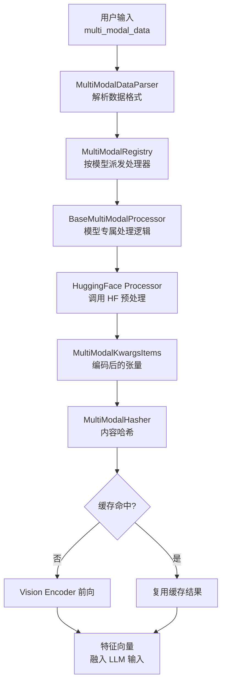
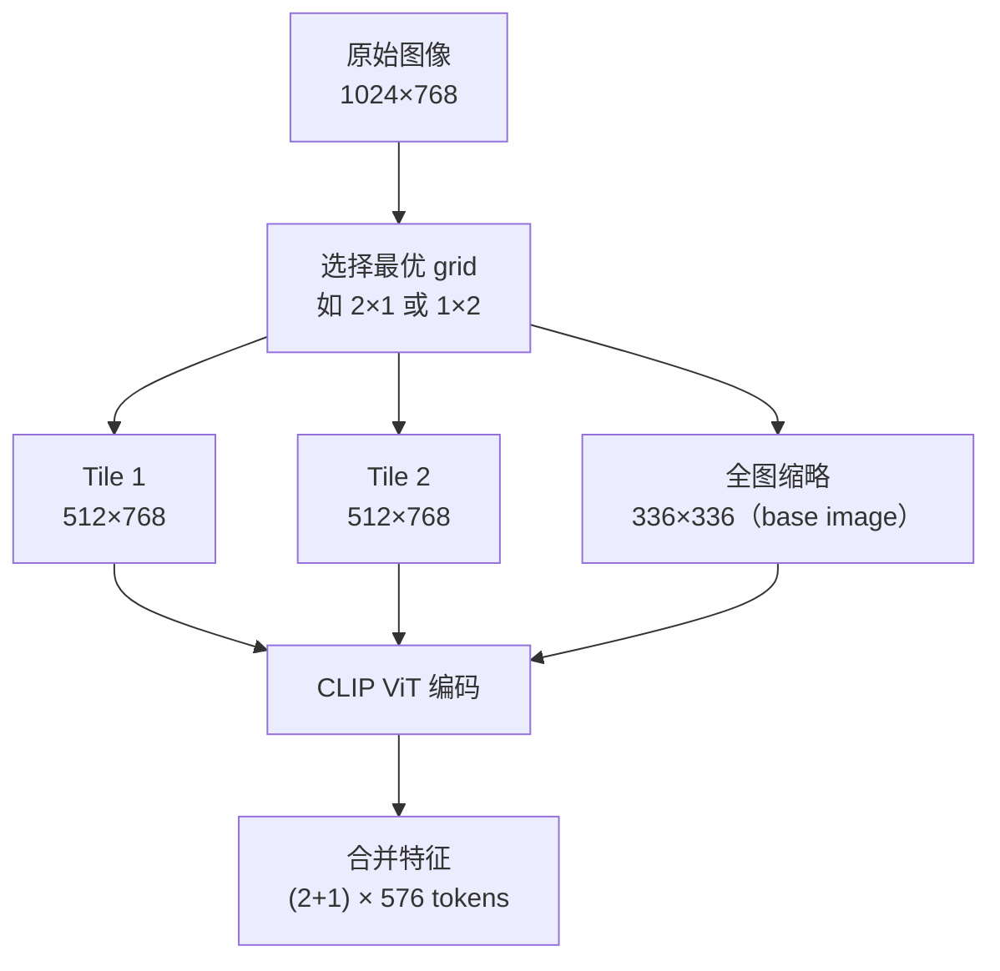
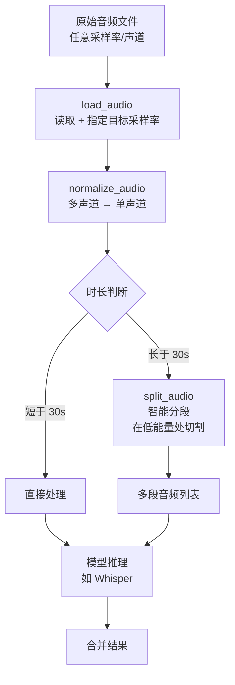
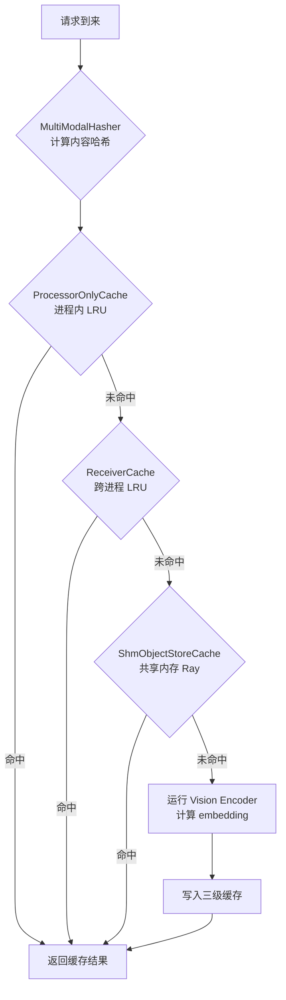

# vLLM 多模态输入处理：深度解析

> 深入理解 vLLM 的多模态架构：图像、视频、音频的处理管线，Vision-Language Model 集成原理，以及生产环境实践

---

## 目录

1. [多模态 LLM 基础](#1-多模态-llm-基础)
2. [vLLM 多模态处理管线](#2-vllm-多模态处理管线)
3. [图像处理](#3-图像处理)
4. [视频处理](#4-视频处理)
5. [音频处理](#5-音频处理)
6. [Vision Encoder 与 LLM 的集成](#6-vision-encoder-与-llm-的集成)
7. [关键数据结构](#7-关键数据结构)
8. [缓存机制](#8-缓存机制)
9. [支持的模型一览](#9-支持的模型一览)
10. [配置与最佳实践](#10-配置与最佳实践)

---

## 1. 多模态 LLM 基础

### 1.1 从文本到多模态

纯文本 LLM 的输入是一维 token 序列。多模态 LLM 需要将图像、视频、音频等不同模态的信息编码成与文本 token **同等维度**的向量，才能送入 Transformer 主干处理。

```mermaid
flowchart LR
    subgraph 输入
        A[文本 token\n"描述这张图"]
        B[图像\n224×224 px]
        C[音频\n16kHz wav]
    end

    subgraph 编码
        D[Text Embedding\nvocab × hidden]
        E[Vision Encoder\nCLIP / SigLIP]
        F[Audio Encoder\nWhisper]
    end

    subgraph 融合
        G[Token 序列\nhidden_size 维向量]
    end

    A --> D --> G
    B --> E --> G
    C --> F --> G
    G --> H[Transformer 主干]
    H --> I[文本输出]
```

**关键挑战**：
- 图像 token 数量远多于文本（一张 336×336 的图约 576 个 token）
- 不同模型对图像 token 的插入位置和占位符格式各不相同
- 视频帧数可达数百帧，需要高效采样和内存管理

### 1.2 主流架构对比

| 架构 | 代表模型 | Vision Encoder | 融合方式 |
|------|---------|---------------|---------|
| Cross-Attention | Flamingo | CLIP ViT-L | 独立 CA 层 |
| Token 拼接 | LLaVA-1.5 | CLIP ViT-L/14 | MLP 投影后拼接 |
| 动态分辨率 | LLaVA-NeXT | CLIP ViT-L/14 | anyres 切图 |
| 原生多模态 | Qwen2-VL | ViT + RoPE 2D | 动态 tile 压缩 |
| 音视频统一 | Ultravox | Whisper + ViT | 联合编码 |

---

## 2. vLLM 多模态处理管线

### 2.1 总体架构

vLLM 的多模态处理分布在 `vllm/multimodal/` 目录中，核心是一个**注册-派发**体系：



### 2.2 各模块职责

| 模块 | 文件 | 职责 |
|------|------|------|
| 解析 | `multimodal/parse.py` | 识别图像/视频/音频数据格式，统一化 |
| 注册 | `multimodal/registry.py` | 为每种模型注册对应的处理器工厂 |
| 处理 | `multimodal/processing/processor.py` | 调用 HF 预处理，生成 placeholder token |
| 哈希 | `multimodal/hasher.py` | 内容哈希，支持跨请求缓存 |
| 缓存 | `multimodal/cache.py` | LRU / 共享内存多级缓存 |
| 图像 | `multimodal/image.py` | 图像格式转换、缩放 |
| 视频 | `multimodal/video.py` | 帧采样、解码 |
| 音频 | `multimodal/audio.py` | 重采样、分段、归一化 |

### 2.3 模型注册方式

每个多模态模型通过装饰器注册处理器：

```python
# vllm/model_executor/models/llava.py（简化）
@MULTIMODAL_REGISTRY.register_processor(
    processor=LlavaNextMultiModalProcessor,
    info=LlavaNextProcessingInfo,
    dummy_inputs=LlavaDummyInputsBuilder,
)
class LLaVANextForConditionalGeneration(nn.Module, SupportsMultiModal):
    ...
```

`SupportsMultiModal` 接口要求实现：
- `get_multimodal_embeddings()`：将编码结果嵌入到 token 序列
- `get_input_embeddings()`：合并文本和多模态 embedding

---

## 3. 图像处理

### 3.1 图像输入格式

vLLM 支持多种图像输入格式，统一通过 `MultiModalDataParser` 解析：

```python
from vllm import LLM
from PIL import Image
import numpy as np
import torch

llm = LLM("llava-hf/llava-1.5-7b-hf")

# 方式1：PIL Image
image = Image.open("photo.jpg")

# 方式2：NumPy array（HWC，uint8）
image = np.array(Image.open("photo.jpg"))

# 方式3：torch Tensor（CHW，float32）
image = torch.from_numpy(np.array(Image.open("photo.jpg"))).permute(2, 0, 1)

# 方式4：URL（vLLM 自动下载）
image = "https://example.com/photo.jpg"

# 方式5：预计算的 embedding（跳过 Vision Encoder）
image = torch.load("image_embedding.pt")  # shape: (num_patches, hidden_size)

outputs = llm.generate({
    "prompt": "USER: <image>\n描述这张图片。\nASSISTANT:",
    "multi_modal_data": {"image": image},
})
```

### 3.2 动态分辨率：anyres

LLaVA-NeXT、LLaVA-OneVision 等模型使用 **anyres（任意分辨率）** 策略，将大图切成多个 tile 分别编码，大幅提升细节识别能力：



**配置示例（LLaVA-NeXT）：**

```python
llm = LLM(
    "llava-hf/llava-v1.6-mistral-7b-hf",
    mm_processor_kwargs={
        "do_resize": True,
        "size": {"shortest_edge": 336, "longest_edge": 1344},
    }
)
```

### 3.3 Qwen2-VL / Qwen2.5-VL 的动态 Tile

Qwen2-VL 系列使用更灵活的动态 tile 策略，并引入 **2D-RoPE** 为每个 patch 附加空间位置编码：

```python
llm = LLM(
    "Qwen/Qwen2.5-VL-7B-Instruct",
    mm_processor_kwargs={
        "min_pixels": 28 * 28,         # 最小 784 pixels
        "max_pixels": 1280 * 28 * 28,  # 最大约 100 万 pixels
    },
    limit_mm_per_prompt={"image": 4},
)

# 多图输入
messages = [
    {
        "role": "user",
        "content": [
            {"type": "image_url", "image_url": {"url": "https://...img1.jpg"}},
            {"type": "image_url", "image_url": {"url": "https://...img2.jpg"}},
            {"type": "text",      "text": "对比这两张图片的差异"},
        ],
    }
]
outputs = llm.chat(messages)
```

### 3.4 RGBA 处理

```python
# 默认白色背景合并 Alpha 通道
llm = LLM(
    "llava-hf/llava-1.5-7b-hf",
    media_io_kwargs={
        "image": {
            "rgba_background_color": [255, 255, 255],  # 白底
        }
    }
)
```

---

## 4. 视频处理

### 4.1 视频帧采样策略

视频处理的核心问题是**如何采样**有限帧数（模型通常最多支持 64-256 帧），同时保留关键信息。

vLLM 内置多种采样后端（`vllm/multimodal/video.py`）：

```mermaid
flowchart TD
    A[视频文件] --> B{Backend 选择}
    B -->|均匀采样| C[VideoBackend\nOpenCV / PyAV\n固定间隔取帧]
    B -->|时长感知| D[DynamicVideoBackend\n按 fps + max_duration 动态决定帧数]
    B -->|自定义| E[Molmo2VideoBackend\n按模型专属逻辑采样]
    B -->|保留字节| F[NemotronVLVideoBackend\n不解码，传原始 bytes]
    C --> G[帧列表\nList[np.ndarray]]
    D --> G
    E --> G
    F --> G
```

### 4.2 视频输入示例

```python
from vllm import LLM, SamplingParams

llm = LLM(
    "llava-hf/llava-onevision-qwen2-7b-ov-hf",
    limit_mm_per_prompt={"video": 1},
    max_model_len=16384,
)

sampling_params = SamplingParams(temperature=0.1, max_tokens=512)

# 方式1：视频文件路径
outputs = llm.generate({
    "prompt": "<|im_start|>user\n<video>\n这个视频讲了什么？<|im_end|>\n<|im_start|>assistant\n",
    "multi_modal_data": {"video": "movie.mp4"},
})

# 方式2：预加载的 numpy 帧数组 (T, H, W, C)
import numpy as np
frames = np.random.uint8(np.zeros((32, 360, 640, 3)))  # 32 帧
outputs = llm.generate({
    "prompt": "...",
    "multi_modal_data": {"video": frames},
})
```

### 4.3 长视频处理

```python
# 使用 DynamicVideoBackend 处理长视频
llm = LLM(
    "Qwen/Qwen2.5-VL-7B-Instruct",
    limit_mm_per_prompt={"video": 1},
    media_io_kwargs={
        "video": {
            "fps": 1,              # 每秒取 1 帧
            "max_duration": 300,   # 最多处理前 5 分钟
            "frame_recovery": True # 损坏帧自动跳过
        }
    }
)
```

### 4.4 视频元数据

vLLM 在处理视频时会收集并传递元数据，帮助模型理解时序信息：

```python
# VideoSourceMetadata 包含：
# - total_frames: 视频总帧数
# - original_fps: 原始帧率
# - duration: 视频时长（秒）

# VideoTargetMetadata 包含：
# - num_frames: 实际采样帧数
# - fps: 采样帧率
# - frames_indices: 采样的帧索引列表
```

---

## 5. 音频处理

### 5.1 音频处理管线



### 5.2 声道归一化

```python
from vllm.multimodal.audio import normalize_audio, ChannelReduction

# 四种声道归一化策略
audio_mono = normalize_audio(
    audio_data,     # shape: (channels, samples)
    spec=ChannelReduction.MEAN,   # 各声道平均（最常用）
    # ChannelReduction.FIRST       # 只取第一声道
    # ChannelReduction.MAX         # 取各时刻最大声道
    # ChannelReduction.SUM         # 声道求和
)
```

### 5.3 长音频智能分段

`split_audio` 在**低能量区域**（自然停顿处）切割，避免在单词中间截断：

```python
from vllm.multimodal.audio import split_audio

chunks = split_audio(
    audio_data=audio,          # shape: (samples,)
    sample_rate=16000,
    max_clip_duration_s=30.0,  # 每段最长 30 秒
    overlap_duration_s=1.0,    # 段间 1 秒重叠（避免丢失边界信息）
    min_energy_window_size=1600  # ~100ms 能量窗口
)
# 返回：List[np.ndarray]，每段约 30 秒
```

### 5.4 Whisper 语音识别示例

```python
from vllm import LLM
from vllm.multimodal.audio import split_audio
import soundfile as sf

llm = LLM(
    "openai/whisper-large-v3-turbo",
    max_model_len=448,
)

# 读取并处理长音频
audio, sr = sf.read("long_speech.wav")
chunks = split_audio(audio, sample_rate=sr, max_clip_duration_s=30.0)

transcriptions = []
for chunk in chunks:
    outputs = llm.generate({
        "prompt": "<|startoftranscript|><|zh|><|transcribe|><|notimestamps|>",
        "multi_modal_data": {"audio": (chunk, sr)},
    })
    transcriptions.append(outputs[0].outputs[0].text)

full_text = "".join(transcriptions)
print(full_text)
```

### 5.5 音视频统一：Ultravox

```python
# Ultravox 同时支持语音和文本
llm = LLM(
    "fixie-ai/ultravox-v0_4-llama-3_1-8b",
    limit_mm_per_prompt={"audio": 1},
)

import librosa
audio, sr = librosa.load("question.wav", sr=16000)

outputs = llm.generate({
    "prompt": "<|audio|>\n",
    "multi_modal_data": {"audio": (audio, sr)},
})
```

---

## 6. Vision Encoder 与 LLM 的集成

### 6.1 主流集成架构

**架构一：MLP 投影（LLaVA-1.5 风格）**

```
图像 → CLIP ViT-L/14 → patch features (N, 1024)
                               ↓
                      2层 MLP Projector
                               ↓
               image tokens (N, hidden_size) → 拼接到文本 token 序列
```

**架构二：Q-Former（BLIP-2 风格）**

```
图像 → ViT → 图像特征
                ↓
          Q-Former（32 个可学习 query）
                ↓
        压缩为 32 个 tokens → 拼接到文本
```

**架构三：原生 2D-RoPE（Qwen2-VL 风格）**

```
图像 → ViT（无位置编码）→ patch 特征
                              ↓
                   动态 tile 合并 + 2D 位置 ID 注入
                              ↓
                   直接参与 LLM 的自注意力（带 2D-RoPE）
```

### 6.2 图像 Token 数量对比

| 模型 | 单图 Token 数 | 动态范围 | 备注 |
|------|------------|---------|------|
| LLaVA-1.5 | 576 | 固定 | CLIP 336×336，每 patch 1 token |
| LLaVA-NeXT | 2880 | 1-5 tile | anyres，最多 5 tile × 576 |
| Qwen2-VL | 动态 | 4-16384 | 按图像内容自适应 |
| Phi-3.5-Vision | 动态 | 最多 16 crops | num_crops 可配置 |
| InternVL2 | 256 | 1-12 tile | 压缩 token 数 |

### 6.3 Placeholder Token 机制

多模态模型使用特殊占位符 token 标记图像嵌入的位置：

```python
# LLaVA 风格
prompt = "USER: <image>\n描述这张图片。\nASSISTANT:"
#               ↑ 对应 576 个 image tokens

# Qwen2-VL 风格
prompt = "<|im_start|>user\n<|vision_start|><|image_pad|><|vision_end|>\n描述这张图片。<|im_end|>"

# vLLM 内部用 PlaceholderRange 追踪这些位置
PlaceholderRange(offset=8, length=576)  # prompt 第 8 个 token 起，连续 576 个
```

### 6.4 Vision Encoder 的 Tensor Parallelism

大型多模态模型（如 GLM-4.5V）需要多 GPU 并行：

```python
llm = LLM(
    "zai-org/GLM-4.5V",
    tensor_parallel_size=4,       # 4 GPU 并行
    max_model_len=32768,
    gpu_memory_utilization=0.9,
    limit_mm_per_prompt={"image": 1},
)
```

Vision Encoder 的权重在 TP 下按列/行切分，与 LLM 主干共享 TP group。

---

## 7. 关键数据结构

### 7.1 MultiModalKwargsItems

处理后的多模态数据统一封装为 `MultiModalKwargsItems`，每个 modality 的每个 item 独立缓存：

```python
# 内部结构（以双图像输入为例）
MultiModalKwargsItems({
    "image": [
        MultiModalKwargsItem({
            "pixel_values": MultiModalFieldElem(
                field=MultiModalBatchedField(),
                data=tensor([3, 336, 336]),  # 第一张图
            ),
            "image_grid_thw": MultiModalFieldElem(...),
        }),
        MultiModalKwargsItem({
            "pixel_values": MultiModalFieldElem(
                field=MultiModalBatchedField(),
                data=tensor([3, 672, 672]),  # 第二张图（不同尺寸）
            ),
        }),
    ]
})
```

### 7.2 三种字段类型（Batching 策略）

| 类型 | 操作 | 使用场景 |
|------|------|---------|
| `MultiModalBatchedField` | stack（dim 0 堆叠） | 图像 pixel_values |
| `MultiModalFlatField` | cat + slice 索引 | 变长序列（动态 tile 数） |
| `MultiModalSharedField` | 广播复制 | 所有 item 共享的配置参数 |

```python
# BachedField 示例：3 张相同尺寸的图
# Input:  [T1(3,336,336), T2(3,336,336), T3(3,336,336)]
# Output: tensor(3, 3, 336, 336)

# FlatField 示例：动态 tile 数的图
# Image1: 2 tiles → tokens[0:1152]
# Image2: 4 tiles → tokens[1152:4224]
# 以 slice 索引区分各图的 token 范围
```

### 7.3 PlaceholderRange

```python
@dataclass
class PlaceholderRange:
    offset: int        # 在 token 序列中的起始位置
    length: int        # 占位符 token 数量
    is_embed: Optional[torch.Tensor] = None  # 可选：布尔掩码（部分嵌入）
```

vLLM 用 `PlaceholderRange` 列表追踪每张图片在 prompt 中的对应位置，供注意力计算和 KV Cache 管理使用。

---

## 8. 缓存机制

### 8.1 三级缓存架构



### 8.2 配置缓存大小

```python
from vllm import LLM

# 使用 4GB LRU 缓存
llm = LLM(
    "Qwen/Qwen2.5-VL-7B-Instruct",
    mm_processor_cache_gb=4,
    mm_processor_cache_type="lru",  # "lru" | "processor_only" | "shm"
)
```

### 8.3 UUID 跨请求复用

对同一张图片的多次请求，通过稳定 UUID 实现**零计算复用**：

```python
from PIL import Image
from vllm import LLM

llm = LLM("llava-hf/llava-1.5-7b-hf", mm_processor_cache_gb=2)
image = Image.open("product.jpg")

# 第一次请求：处理器运行，结果写入缓存
out1 = llm.generate({
    "prompt": "USER: <image>\n这个产品的颜色是？\nASSISTANT:",
    "multi_modal_data": {"image": image},
    "multi_modal_uuids": {"image": "product-abc123"},  # 稳定 UUID
})

# 第二次请求：直接命中缓存，跳过 Vision Encoder
out2 = llm.generate({
    "prompt": "USER: <image>\n这个产品的尺寸是？\nASSISTANT:",
    "multi_modal_data": {"image": image},
    "multi_modal_uuids": {"image": "product-abc123"},  # 相同 UUID → 缓存命中
})
```

---

## 9. 支持的模型一览

### 9.1 图像模型

| 模型系列 | 代表模型 | 特点 |
|---------|---------|------|
| LLaVA | `llava-hf/llava-1.5-7b-hf` | 经典基线，CLIP + MLP |
| LLaVA-NeXT | `llava-hf/llava-v1.6-mistral-7b-hf` | anyres 动态分辨率 |
| LLaVA-OneVision | `llava-hf/llava-onevision-qwen2-7b` | 支持视频 |
| Qwen2-VL | `Qwen/Qwen2-VL-7B-Instruct` | 2D-RoPE，高分辨率 |
| Qwen2.5-VL | `Qwen/Qwen2.5-VL-7B-Instruct` | 增强版 Qwen2-VL |
| Qwen3-VL | `Qwen/Qwen3-VL-7B-Instruct` | 最新一代 |
| Phi-3.5-Vision | `microsoft/Phi-3.5-vision-instruct` | 轻量高效 |
| InternVL2 | `OpenGVLab/InternVL2-8B` | 动态分辨率，中文优秀 |
| GLM-4V | `zai-org/GLM-4.5V` | 中文多模态 |
| Llama 4 | `meta-llama/Llama-4-Scout-17B-16E-Instruct` | 131K 超长上下文 |
| MiniCPM-V | `openbmb/MiniCPM-V-2_6` | 端侧部署友好 |

### 9.2 视频模型

| 模型 | 最大帧数 | 备注 |
|------|---------|------|
| LLaVA-OneVision | 32 帧 | 均匀采样 |
| Qwen2-VL / 2.5-VL | 动态 | 支持 fps 控制 |
| InternVL2-Video | 64 帧 | 专项视频优化 |
| Molmo2 | 自定义 | 专属 VideoBackend |

### 9.3 音频模型

| 模型 | 任务 | 备注 |
|------|------|------|
| `openai/whisper-large-v3-turbo` | 语音识别 ASR | 主流 STT 模型 |
| `fixie-ai/ultravox-v0_4` | 语音对话 | 音频 + 文本联合 |
| Qwen2-Audio | 音频理解 | 中文支持好 |

---

## 10. 配置与最佳实践

### 10.1 完整配置示例

```python
from vllm import LLM, SamplingParams

llm = LLM(
    model="Qwen/Qwen2.5-VL-7B-Instruct",

    # 多模态数量限制（防止 OOM）
    limit_mm_per_prompt={
        "image": 4,
        "video": 1,
    },

    # 模型专属处理参数
    mm_processor_kwargs={
        "min_pixels": 28 * 28,         # 最小 784 像素
        "max_pixels": 1280 * 28 * 28,  # 最大约 100 万像素
    },

    # 媒体 I/O 参数
    media_io_kwargs={
        "image": {"rgba_background_color": [255, 255, 255]},
        "video": {"fps": 2, "max_duration": 120, "frame_recovery": True},
    },

    # 缓存配置
    mm_processor_cache_gb=4,
    mm_processor_cache_type="lru",

    # 基础配置
    max_model_len=32768,
    gpu_memory_utilization=0.9,
    tensor_parallel_size=1,
)
```

### 10.2 最佳实践

**实践一：根据任务限制图像分辨率**

```python
# 文档 OCR / 细节识别：允许高分辨率
mm_processor_kwargs={"max_pixels": 1280 * 28 * 28}

# 场景描述 / 快速问答：限制分辨率节省显存
mm_processor_kwargs={"max_pixels": 448 * 448}
```

**实践二：批量处理相同来源的图像启用 UUID 缓存**

```python
# 同一产品图库的多次查询
for question in questions:
    llm.generate({
        "prompt": f"USER: <image>\n{question}\nASSISTANT:",
        "multi_modal_data": {"image": product_image},
        "multi_modal_uuids": {"image": f"product-{product_id}"},  # 固定 UUID
    })
```

**实践三：多 GPU 时合理分配内存**

```python
# 4 GPU，视觉任务密集
llm = LLM(
    model="Qwen/Qwen2.5-VL-72B-Instruct",
    tensor_parallel_size=4,
    gpu_memory_utilization=0.85,
    max_num_seqs=8,           # 降低并发避免 OOM
    mm_processor_cache_gb=8,  # 增大缓存
)
```

**实践四：服务端启动命令**

```bash
# 启动多模态服务
vllm serve Qwen/Qwen2.5-VL-7B-Instruct \
    --limit-mm-per-prompt '{"image": 4, "video": 1}' \
    --mm-processor-kwargs '{"max_pixels": 1003520}' \
    --max-model-len 32768 \
    --gpu-memory-utilization 0.9
```

### 10.3 常见问题排查

| 问题 | 原因 | 解决方案 |
|------|------|---------|
| OOM during vision encoding | 图像分辨率过高/batch 过大 | 降低 `max_pixels`，减小 `limit_mm_per_prompt` |
| Token 数超限 | 高分辨率图产生过多 image tokens | 减小 `max_pixels` 或增大 `max_model_len` |
| 视频帧加载慢 | 未安装 PyAV | `pip install av`，指定 `"backend": "pyav"` |
| 音频转录不完整 | 未分段处理长音频 | 使用 `split_audio()` 分段推理 |

---

## 参考资料

1. **vLLM 多模态官方文档**：[Multimodal Inputs](https://docs.vllm.ai/en/latest/usage/multimodal_inputs.html)
2. **LLaVA 论文**：[Visual Instruction Tuning](https://arxiv.org/abs/2304.08485)
3. **LLaVA-NeXT 论文**：[LLaVA-NeXT: Improved Reasoning, OCR, and World Knowledge](https://llava-vl.github.io/blog/2024-01-30-llava-next/)
4. **Qwen2-VL 论文**：[Qwen2-VL: Enhancing Vision-Language Model's Perception of the World at Any Resolution](https://arxiv.org/abs/2409.12191)
5. **vLLM multimodal 源码**：[vllm/multimodal/](https://github.com/vllm-project/vllm/tree/main/vllm/multimodal)
6. **vLLM 多模态示例**：[examples/multimodal/](https://github.com/vllm-project/vllm/tree/main/examples/multimodal)
7. **支持的 VLM 模型列表**：[Supported VLMs](https://docs.vllm.ai/en/latest/models/supported_models.html#multimodal-language-models)
