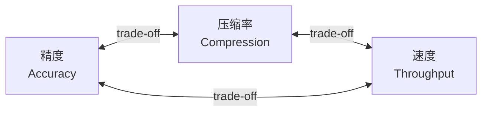
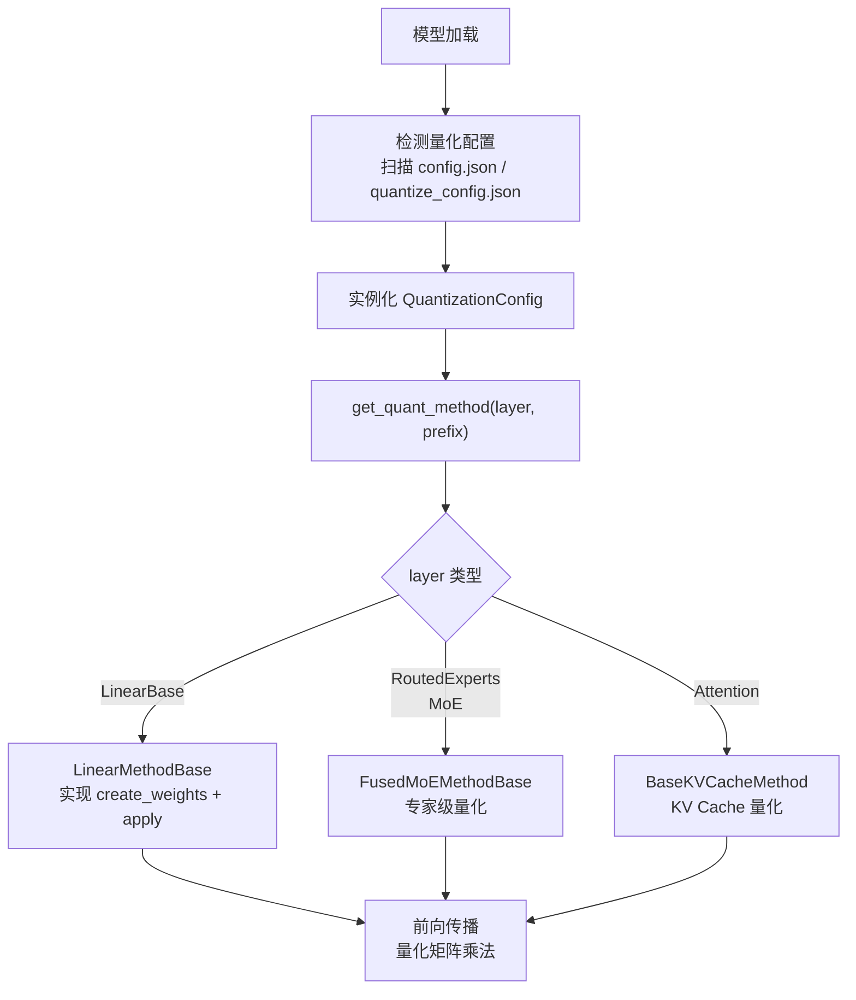
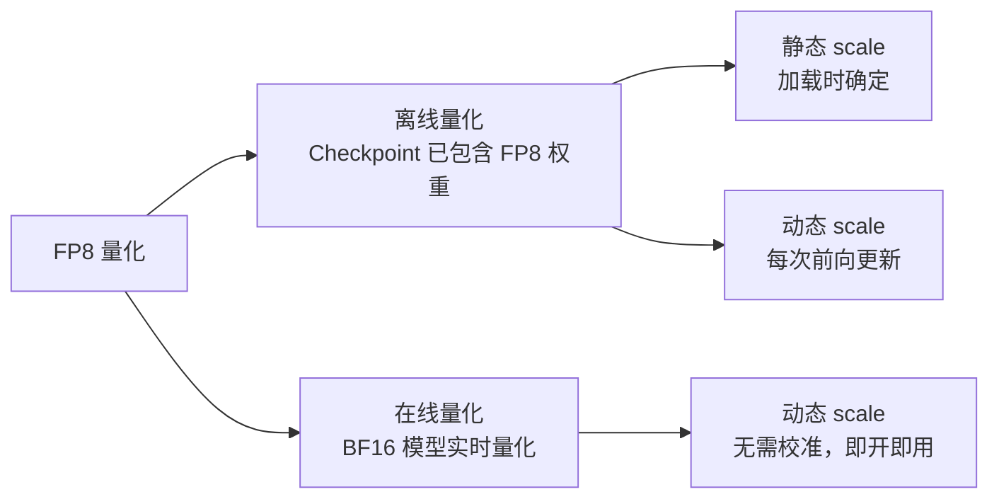
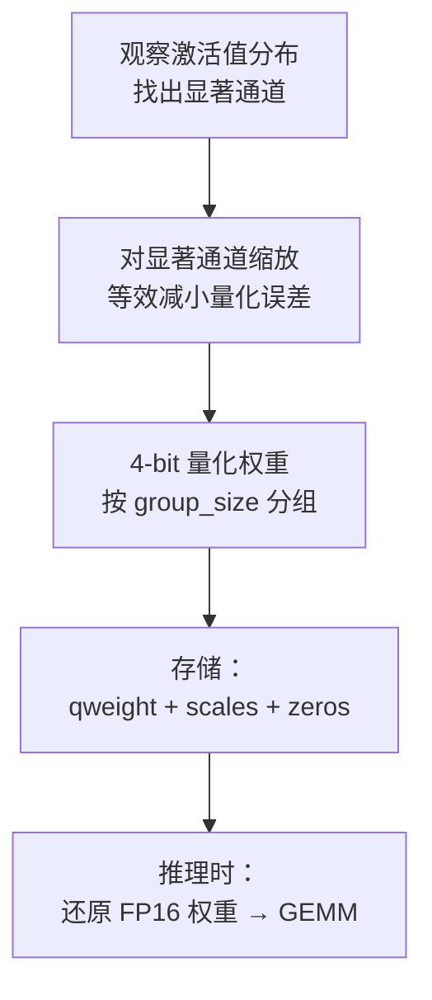
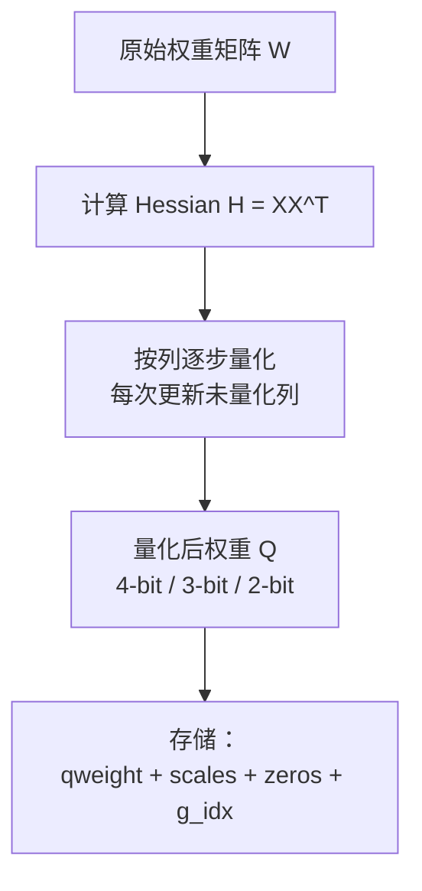
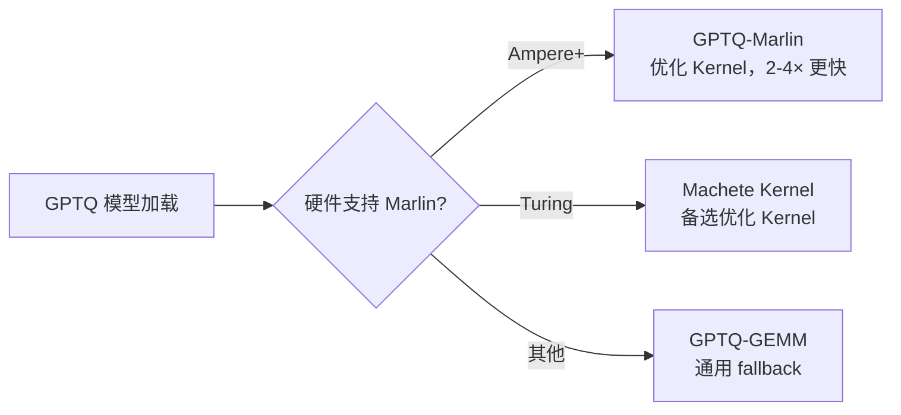
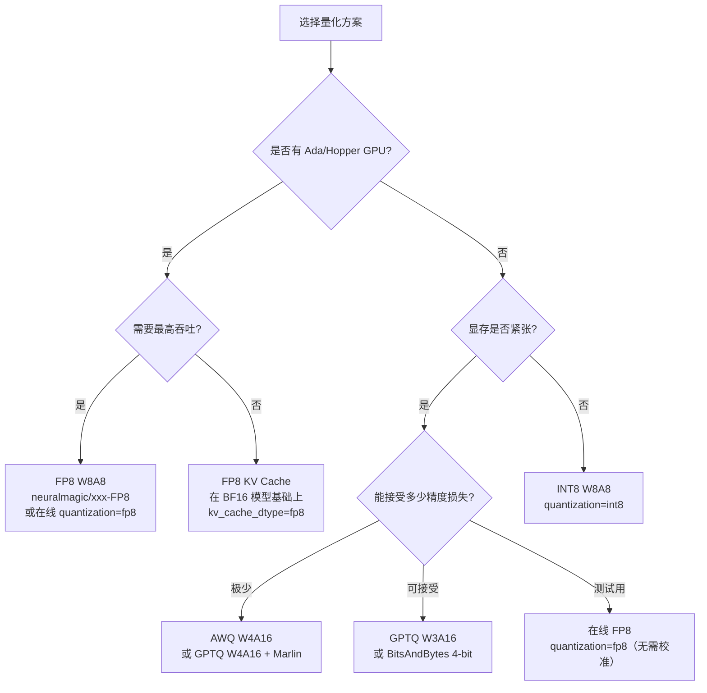

# vLLM 量化策略与压缩技术：深度解析

> 深入理解 vLLM 的量化体系：FP8、AWQ、GPTQ、INT8 等 28+ 种量化方法的原理、实现细节与生产实践

---

## 目录

1. [量化基础与动机](#1-量化基础与动机)
2. [vLLM 量化架构](#2-vllm-量化架构)
3. [FP8 量化（W8A8）](#3-fp8-量化w8a8)
4. [AWQ 量化](#4-awq-量化)
5. [GPTQ 量化](#5-gptq-量化)
6. [INT8 量化](#6-int8-量化)
7. [KV Cache 量化](#7-kv-cache-量化)
8. [在线动态量化](#8-在线动态量化)
9. [其他量化方法](#9-其他量化方法)
10. [硬件支持矩阵](#10-硬件支持矩阵)
11. [性能对比与选择指南](#11-性能对比与选择指南)
12. [模型量化工具链](#12-模型量化工具链)
13. [使用示例与最佳实践](#13-使用示例与最佳实践)

---

## 1. 量化基础与动机

### 1.1 为什么需要量化？

大语言模型的参数量极大，以 BF16 存储时内存占用惊人：

| 模型规模 | BF16 显存 | FP8 显存 | INT4 显存 |
|---------|---------|---------|---------|
| 7B | ~14 GB | ~7 GB | ~3.5 GB |
| 13B | ~26 GB | ~13 GB | ~6.5 GB |
| 70B | ~140 GB | ~70 GB | ~35 GB |
| 405B | ~810 GB | ~405 GB | ~200 GB |

量化的三重收益：
- **内存降低**：INT4 理论节省 4×，FP8 节省 2×
- **吞吐提升**：更小的数据类型降低内存带宽压力，提升 GPU 利用率
- **部署成本**：单卡可运行更大模型，多卡并行需求降低

### 1.2 量化的核心权衡



**量化维度**：

| 维度 | 说明 | 常见选项 |
|------|------|---------|
| **量化对象** | 量化权重还是同时量化激活值 | W-only vs W+A |
| **位宽** | 用几 bit 表示一个值 | 4-bit, 8-bit, FP8 |
| **粒度** | 一个 scale 覆盖多少个值 | per-tensor, per-channel, per-group |
| **时机** | 离线预量化还是推理时动态量化 | PTQ vs 在线量化 |
| **校准** | 是否需要校准数据集 | 无校准(RTN) vs 有校准(GPTQ/AWQ) |

### 1.3 量化命名规范

业界通常用 `WxAy` 表示量化配置：
- **W4A16**：权重 4-bit，激活 16-bit（weight-only）
- **W8A8**：权重和激活均为 8-bit（FP8 / INT8）
- **W4A8**：权重 4-bit，激活 8-bit（混合精度）

---

## 2. vLLM 量化架构

### 2.1 插件化设计

vLLM 的量化系统采用**插件化（Plugin-based）架构**，支持 28+ 种量化方法，所有方法共享统一接口：



### 2.2 核心接口

```python
# vllm/model_executor/layers/quantization/base_config.py（简化）

class QuantizationConfig:
    @abstractmethod
    def get_name(self) -> str:
        """量化方法名称，如 'fp8', 'awq', 'gptq'"""

    @abstractmethod
    def get_supported_act_dtypes(self) -> list[torch.dtype]:
        """支持的激活数据类型"""

    @classmethod
    @abstractmethod
    def get_min_capability(cls) -> int:
        """最低 GPU compute capability，如 89（Ada Lovelace）"""

    @classmethod
    @abstractmethod
    def from_config(cls, config: dict) -> "QuantizationConfig":
        """从 checkpoint 的 config.json 加载配置"""

    @abstractmethod
    def get_quant_method(
        self,
        layer: torch.nn.Module,
        prefix: str,
    ) -> Optional[QuantizeMethodBase]:
        """为指定 layer 返回对应的量化方法实现"""


class QuantizeMethodBase:
    @abstractmethod
    def create_weights(self, layer, ...):
        """创建量化权重参数（packed int4, fp8 等）"""

    @abstractmethod
    def apply(self, layer, x, bias=None):
        """前向传播：执行量化矩阵乘法"""

    def process_weights_after_loading(self, layer):
        """加载后处理：转置、重排、预计算 scale 等"""
```

### 2.3 量化方法注册

```python
# vllm/model_executor/layers/quantization/__init__.py

_QUANTIZATION_METHODS = {
    "awq":                AWQConfig,
    "gptq":               GPTQConfig,
    "gptq_marlin":        GPTQMarlinConfig,
    "awq_marlin":         AWQMarlinConfig,
    "fp8":                Fp8Config,
    "int8":               Int8Config,
    "gguf":               GGUFConfig,
    "bitsandbytes":       BitsAndBytesConfig,
    "compressed-tensors": CompressedTensorsConfig,
    "modelopt":           ModelOptConfig,
    "quark":              QuarkConfig,
    "torchao":            TorchAOConfig,
    # ... 共 28+ 种
}
```

---

## 3. FP8 量化（W8A8）

### 3.1 FP8 数据格式

FP8 是 NVIDIA Hopper（H100）和 Ada Lovelace（RTX 4090）架构引入的原生数据类型：

| 格式 | 符号位 | 指数位 | 尾数位 | 数值范围 | 精度 |
|------|--------|--------|--------|---------|------|
| **E4M3** | 1 | 4 | 3 | ±448 | 较高，范围较窄 |
| **E5M2** | 1 | 5 | 2 | ±57344 | 较低，范围较宽 |
| BF16（对比）| 1 | 8 | 7 | ±3.4×10³⁸ | — |

vLLM 默认使用 **E4M3** 存储权重，**E5M2** 存储梯度（推理时不涉及）。

### 3.2 FP8 量化类型



### 3.3 Fp8Config 配置

```python
# vllm/model_executor/layers/quantization/fp8.py（简化）
@dataclass
class Fp8Config(QuantizationConfig):
    # 是否为预量化的 FP8 checkpoint
    is_checkpoint_fp8_serialized: bool = False

    # 激活量化方案
    activation_scheme: str = "dynamic"  # "dynamic" | "static"

    # 跳过量化的层
    ignored_layers: list[str] = field(default_factory=list)

    # 块量化维度（DeepSeek 风格的 W4A8 block 量化）
    weight_block_size: Optional[list[int]] = None  # 如 [128, 128]
```

### 3.4 离线 FP8 量化

使用 `llm-compressor` 对模型进行 FP8 量化（W8A8）：

```python
# 量化脚本（一次性，生成量化 checkpoint）
from transformers import AutoTokenizer
from llmcompressor.modifiers.quantization import QuantizationModifier
from llmcompressor import oneshot

model_id = "meta-llama/Llama-3.1-8B-Instruct"
tokenizer = AutoTokenizer.from_pretrained(model_id)

# 定义量化配置
recipe = QuantizationModifier(
    targets="Linear",
    scheme="FP8_DYNAMIC",    # W8A8，动态激活 scale
    ignore=["lm_head"],      # 保持 lm_head 为 BF16
)

# 执行量化（需要少量校准数据）
oneshot(
    model=model_id,
    recipe=recipe,
    output_dir="./Llama-3.1-8B-FP8",
    num_calibration_samples=512,
)
```

### 3.5 使用 FP8 模型

```python
from vllm import LLM, SamplingParams

# 方式1：使用预量化的 FP8 checkpoint
llm = LLM("neuralmagic/Meta-Llama-3.1-8B-Instruct-FP8")

# 方式2：对任意 BF16 模型在线 FP8 量化（无需预量化）
llm = LLM(
    "meta-llama/Llama-3.1-8B-Instruct",
    quantization="fp8",           # 在线动态 FP8
    # kv_cache_dtype="fp8",       # 同时启用 KV Cache FP8（见第7节）
)

sampling_params = SamplingParams(temperature=0.7, max_tokens=256)
outputs = llm.generate(["介绍一下大语言模型"], sampling_params)
print(outputs[0].outputs[0].text)
```

**CLI 方式：**

```bash
# 使用预量化 checkpoint
vllm serve neuralmagic/Meta-Llama-3.1-8B-Instruct-FP8

# 在线 FP8 量化
vllm serve meta-llama/Llama-3.1-8B-Instruct --quantization fp8
```

### 3.6 DeepSeek 风格的 Block FP8

DeepSeek-V3 / R1 使用 **块量化（Block Quantization）**，每个 128×128 的权重块共享一个 scale，在保持精度的同时实现 FP8 加速：

```python
# DeepSeek-V3 的量化配置
# weight_block_size = [128, 128]
# 每 128×128 权重块 → 1 个 E8M0 scale

llm = LLM(
    "deepseek-ai/DeepSeek-V3",
    quantization="fp8",           # 自动识别 block FP8
    tensor_parallel_size=8,
    max_model_len=32768,
)
```

---

## 4. AWQ 量化

### 4.1 AWQ 原理

**AWQ（Activation-aware Weight Quantization）** 的核心洞察：**并非所有权重通道对量化误差同等敏感**，与大激活值对应的权重通道对精度影响更大。



**数学表达**：

对于激活显著的通道 $i$，将权重缩放 $W_i \leftarrow W_i / s_i$，激活对应缩放 $x_i \leftarrow x_i \cdot s_i$，两者等价但前者减小了需要量化的权重幅度，降低量化误差。

### 4.2 AWQConfig

```python
@dataclass
class AWQConfig(QuantizationConfig):
    weight_bits: int = 4        # 仅支持 4-bit
    group_size: int = 128       # 每组共享 scale/zero，通常 64 或 128
    zero_point: bool = True     # 是否使用 zero point（非对称量化）
    modules_to_not_convert: list[str] = []  # 跳过的层
```

**存储格式**：8 个 4-bit 值打包为 1 个 int32，AWQ 使用特定的打包顺序（非标准 GPTQ 顺序）。

### 4.3 AWQ vs AWQ-Marlin

vLLM 提供两个 AWQ 实现：

| 特性 | AWQ（原版） | AWQ-Marlin（优化版） |
|------|------------|-------------------|
| Kernel | 自定义 CUDA | Marlin 框架 |
| 性能 | 基准 | 约 1.5-2× 更快 |
| 硬件要求 | Turing（75）以上 | Ampere（80）以上 |
| 自动选择 | ✗ | ✓（vLLM 自动降级到 Marlin） |

### 4.4 使用 AWQ 模型

```python
from vllm import LLM

# AWQ 量化模型（HuggingFace 上有大量现成模型）
llm = LLM("TheBloke/Llama-2-13B-chat-AWQ")

# 自定义 group_size
llm = LLM(
    "TheBloke/Llama-2-13B-chat-AWQ",
    quantization="awq",         # 通常可省略（从 config 自动检测）
)
```

```bash
# CLI
vllm serve TheBloke/Llama-2-13B-chat-AWQ
```

---

## 5. GPTQ 量化

### 5.1 GPTQ 原理

**GPTQ** 基于 **Optimal Brain Compression（OBC）** 理论，逐层最小化量化误差：

$$\min_{Q(W)} \|WX - Q(W)X\|_F^2$$

通过 Hessian 矩阵的近似计算，确定每列权重的量化顺序和补偿更新，使整体误差最小。



### 5.2 GPTQConfig

```python
@dataclass
class GPTQConfig(QuantizationConfig):
    weight_bits: int        # 2, 3, 4 或 8 bit
    group_size: int = -1    # -1 表示 per-column，通常设 128
    desc_act: bool = False  # 是否按激活降序排列（提升精度，降低速度）
    lm_head_quantized: bool = False  # 是否量化输出头

    # 混合精度：不同层使用不同 bit 数
    dynamic: dict = field(default_factory=dict)
    # 示例：{"model.layers.0.self_attn.q_proj": {"bits": 8}}
```

### 5.3 GPTQ vs GPTQ-Marlin



**Marlin 的关键优化**：
- 权重以 Marlin 格式重排（列优先 tile），提升 L1 Cache 命中率
- 支持 2/3/4/8-bit，支持对称和非对称量化
- 在 A100/H100 上比原版 GPTQ kernel 快 2-4 倍

### 5.4 使用 GPTQ 模型

```python
from vllm import LLM

# 4-bit GPTQ（最常用）
llm = LLM("TheBloke/Llama-2-13B-GPTQ")

# ExLlamaV2 优化的 GPTQ（EXL2 格式）
llm = LLM("turboderp/Llama-3-8B-instruct-exl2")

# 混合精度 GPTQ（关键层 8-bit，其余 4-bit）
llm = LLM(
    "model-path",
    quantization="gptq",
    # dynamic 配置在 quantize_config.json 中
)
```

```bash
# CLI
vllm serve TheBloke/Llama-2-13B-chat-GPTQ
```

---

## 6. INT8 量化

### 6.1 W8A8 INT8 原理

INT8 量化将权重和激活均量化为 8-bit 整数，矩阵乘法完全在 INT8 下执行（利用 Tensor Core 的 INT8 路径），输出累加后反量化回 FP16/BF16：

```
输入激活 x (FP16) → 量化 → x_int8 (INT8, scale_x)
权重 W (FP16)      → 量化 → W_int8 (INT8, scale_w)

INT8 GEMM: y_int32 = W_int8 @ x_int8
反量化: y_fp16 = y_int32 * scale_w * scale_x
```

### 6.2 使用 INT8 模型

```python
# neuralmagic 提供了大量 INT8 量化模型
llm = LLM("neuralmagic/Llama-3.1-8B-Instruct-quantized-int8")

# 或对任意模型在线 INT8 量化
llm = LLM(
    "meta-llama/Llama-3.1-8B-Instruct",
    quantization="int8",
)
```

### 6.3 INT8 vs FP8 对比

| 维度 | INT8 W8A8 | FP8 W8A8 |
|------|----------|---------|
| **精度** | 略低（整数截断） | 更高（浮点表示） |
| **硬件** | Turing 75+ | Ada 89 / Hopper 90 |
| **速度** | 快 | 更快（原生硬件支持）|
| **校准** | 通常需要 | 可以不需要（动态） |

---

## 7. KV Cache 量化

### 7.1 为什么要量化 KV Cache？

在长上下文场景（32K+），KV Cache 可能占用比模型参数更多的显存：

```
KV Cache 大小 = 2 × num_layers × num_heads × head_dim × seq_len × batch_size × dtype_bytes

例：Llama-3-8B，BF16，32K 序列，batch=8：
= 2 × 32 × 32 × 128 × 32768 × 8 × 2 bytes ≈ 137 GB
```

将 KV Cache 从 BF16 量化为 FP8，显存减少 **50%**，可服务更长上下文或更大 batch。

### 7.2 KV Cache FP8 配置

```python
from vllm import LLM

llm = LLM(
    "meta-llama/Llama-3.1-8B-Instruct",
    kv_cache_dtype="fp8",         # KV Cache 使用 FP8
    calculate_kv_scales=True,     # 自动计算 scale（从 warmup 数据）
)
```

**三种 scale 初始化策略**：

| 策略 | 说明 | 精度 | 适用场景 |
|------|------|------|---------|
| 无校准 | scale = 1.0 | 较低 | 快速测试 |
| Warmup 自动计算 | `calculate_kv_scales=True` | 中等 | 生产部署 |
| 数据集校准 | llm-compressor 校准 | 最高 | 精度敏感场景 |

### 7.3 Per-Head KV Scale（高精度模式）

```bash
# 使用 llm-compressor 生成 per-head scale
python -c "
from llmcompressor import oneshot
from llmcompressor.modifiers.quantization import QuantizationModifier

oneshot(
    model='meta-llama/Llama-3.1-8B-Instruct',
    recipe=QuantizationModifier(
        targets='Attention',
        scheme='FP8_KV_CACHE_PER_HEAD'
    ),
    output_dir='./Llama-3.1-8B-FP8-KV',
    num_calibration_samples=512,
)
"

# 使用带 per-head KV scale 的模型
vllm serve ./Llama-3.1-8B-FP8-KV --kv-cache-dtype fp8
```

---

## 8. 在线动态量化

### 8.1 什么是在线量化

**离线量化**：需要提前对模型做量化，生成特殊 checkpoint。
**在线量化**：在推理时实时量化，**直接使用原始 BF16 模型**，无需任何预处理。

优点：无需校准数据集，无需额外工具，即开即用。
代价：量化质量略低于精心校准的离线量化，且有一定计算开销。

### 8.2 支持的在线量化方案

```python
class OnlineQuantScheme(Enum):
    FP8_PER_TENSOR = "fp8_per_tensor"    # 每个 tensor 一个 scale
    FP8_PER_BLOCK  = "fp8_per_block"     # DeepSeek 风格块量化
    MXFP8          = "mxfp8"             # Microscaling FP8
    INT8_WEIGHT_ONLY = "int8_per_channel_weight_only"  # 仅权重 INT8（MoE 专用）
```

### 8.3 在线量化示例

```python
from vllm import LLM

# FP8 在线量化（最常用）
llm = LLM(
    "meta-llama/Llama-3.1-8B-Instruct",
    quantization="fp8",
)

# 对 MoE 模型的专家权重做在线 INT8
llm = LLM(
    "mistralai/Mixtral-8x7B-Instruct-v0.1",
    quantization="experts_int8",  # 仅量化 MoE 专家权重
)
```

---

## 9. 其他量化方法

### 9.1 GGUF（llama.cpp 格式）

GGUF 是 `llama.cpp` 的模型格式，支持 Q2_K ~ Q8_0 多种量化粒度，主要用于 CPU 推理，vLLM 在 GPU 上也支持加载：

```python
llm = LLM("bartowski/Meta-Llama-3.1-8B-Instruct-GGUF")
```

### 9.2 BitsAndBytes（4-bit NF4 / 8-bit INT8）

来自 Hugging Face 的量化库，支持 QLoRA 训练场景：

```python
llm = LLM(
    "meta-llama/Llama-3.1-8B-Instruct",
    quantization="bitsandbytes",
    load_format="bitsandbytes",
    bnb_config={
        "load_in_4bit": True,
        "bnb_4bit_quant_type": "nf4",
        "bnb_4bit_compute_dtype": "bfloat16",
    }
)
```

### 9.3 Compressed-Tensors（SparseML）

Neural Magic 的统一量化格式，支持任意混合精度：

```python
# 混合精度：部分层 FP8，部分层 INT4
llm = LLM("neuralmagic/Llama-3.1-8B-Instruct-quantized-w4a16")
```

### 9.4 MXFP4（DeepSeek 超低位宽）

Microscaling FP4 是新一代超低位宽格式，每 32 个值共享一个 E8M0 scale，对应 DeepSeek 的 MLA 激活量化：

```python
llm = LLM(
    "deepseek-ai/DeepSeek-V3",
    quantization="mxfp4",
    tensor_parallel_size=8,
)
```

### 9.5 MoE 专项：MoE-WNA16

对 MoE 模型的专家权重单独量化，非专家权重保持 BF16：

```python
llm = LLM(
    "mistralai/Mixtral-8x7B-Instruct-v0.1",
    quantization="moe_wna16",  # 专家权重 INT4，路由器 BF16
)
```

---

## 10. 硬件支持矩阵

| 量化方法 | Turing T4/2080（75） | Ampere A100（80-86） | Ada 4090（89） | Hopper H100（90） | AMD MI | 说明 |
|---------|:------------------:|:-------------------:|:-------------:|:----------------:|:-----:|------|
| AWQ W4A16 | ✓ | ✓ | ✓ | ✓ | ✗ | Marlin 需 Ampere+ |
| GPTQ W4A16 | ✓ | ✓ | ✓ | ✓ | ✗ | Marlin 需 Ampere+ |
| INT8 W8A8 | ✓ | ✓ | ✓ | ✓ | ✗ | |
| FP8 W8A8 | ✗ | ✗ | ✓ | ✓ | ✓（ROCm） | Ada/Hopper 原生 |
| FP8 KV Cache | ✗ | ✗ | ✓ | ✓ | ✓ | |
| MXFP4 | ✗ | ✗ | ✗ | ✓（Blackwell）| ✗ | 需要 Blackwell |
| BitsAndBytes | ✓ | ✓ | ✓ | ✓ | ✗ | 不支持 Marlin |
| GGUF | ✓ | ✓ | ✓ | ✓ | ✓ | 跨平台 |
| Marlin Kernel | ✗ | ✓ | ✓ | ✓ | ✗ | 需要 SM80+ |

---

## 11. 性能对比与选择指南

### 11.1 量化方法性能对比（Llama-3-8B，A100）

| 配置 | 显存 | 吞吐（tokens/s） | 精度损失（PPL↑） |
|------|------|----------------|----------------|
| BF16（基线） | 16 GB | 100% | 0% |
| INT8 W8A8 | 8 GB | ~130% | ~0.1% |
| FP8 W8A8 | 8 GB | ~160% | ~0.05% |
| AWQ W4A16 | 5 GB | ~120% | ~0.3% |
| GPTQ W4A16 | 5 GB | ~120% | ~0.2% |
| GPTQ W3A16 | 4 GB | ~110% | ~1.5% |
| GPTQ W2A16 | 3 GB | ~105% | ~5%+ |

> 注：以上数据为社区基准参考，实际结果依模型、任务、硬件有所不同。

### 11.2 选择决策树



### 11.3 各量化方法推荐场景

| 场景 | 推荐方案 | 原因 |
|------|---------|------|
| H100 生产部署 | FP8 W8A8 | 原生硬件支持，精度损失极小 |
| A100 长上下文 | BF16 + FP8 KV Cache | 节省 KV Cache 显存 |
| A100 高吞吐 | INT8 W8A8 | Tensor Core INT8 路径 |
| RTX 4090 消费级 | AWQ / GPTQ W4 | 4× 显存节省 |
| 多种 GPU 混合 | GPTQ W4 + Marlin | 广泛兼容性 |
| 快速测试/原型 | 在线 FP8（`quantization=fp8`）| 无需预量化 |
| 超大模型（70B+）| FP8 + TP | 结合量化和并行 |

---

## 12. 模型量化工具链

### 12.1 llm-compressor（推荐）

Neural Magic 出品，与 vLLM 深度集成，支持 FP8、INT8 校准量化：

```bash
pip install llmcompressor
```

```python
from llmcompressor import oneshot
from llmcompressor.modifiers.quantization import QuantizationModifier
from datasets import load_dataset

model_id = "meta-llama/Llama-3.1-8B-Instruct"

# 准备校准数据
calibration_data = load_dataset("HuggingFaceH4/ultrachat_200k", split="train_sft[:512]")

# FP8 W8A8 量化
recipe = QuantizationModifier(
    targets="Linear",
    scheme="FP8_DYNAMIC",
    ignore=["lm_head"],
)

oneshot(
    model=model_id,
    recipe=recipe,
    output_dir="./Llama-3.1-8B-FP8",
    dataset=calibration_data,
    num_calibration_samples=512,
    max_seq_length=2048,
)
```

### 12.2 AutoGPTQ

生成 GPTQ 格式量化模型：

```bash
pip install auto-gptq
```

```python
from auto_gptq import AutoGPTQForCausalLM, BaseQuantizeConfig
from transformers import AutoTokenizer

model_id = "meta-llama/Llama-3.1-8B-Instruct"
tokenizer = AutoTokenizer.from_pretrained(model_id)

quantize_config = BaseQuantizeConfig(
    bits=4,
    group_size=128,
    desc_act=False,    # False 更快，True 更准
)

model = AutoGPTQForCausalLM.from_pretrained(model_id, quantize_config)

# 校准数据
examples = [tokenizer("GPT-4 is a large language model", return_tensors="pt")]
model.quantize(examples)
model.save_quantized("./Llama-3.1-8B-GPTQ")
```

### 12.3 AutoAWQ

生成 AWQ 格式量化模型：

```bash
pip install autoawq
```

```python
from awq import AutoAWQForCausalLM
from transformers import AutoTokenizer

model_id = "meta-llama/Llama-3.1-8B-Instruct"
tokenizer = AutoTokenizer.from_pretrained(model_id)

model = AutoAWQForCausalLM.from_pretrained(model_id)

quant_config = {
    "zero_point": True,
    "q_group_size": 128,
    "w_bit": 4,
    "version": "GEMM",
}

model.quantize(tokenizer, quant_config=quant_config)
model.save_quantized("./Llama-3.1-8B-AWQ")
```

---

## 13. 使用示例与最佳实践

### 13.1 完整配置速查

```python
from vllm import LLM, SamplingParams

# ── FP8（H100 / RTX 4090，最推荐）────────────────────
llm = LLM("neuralmagic/Meta-Llama-3.1-8B-Instruct-FP8")

# ── FP8 在线量化（无预量化模型时）─────────────────────
llm = LLM("meta-llama/Llama-3.1-8B-Instruct", quantization="fp8")

# ── FP8 + KV Cache FP8（长上下文）────────────────────
llm = LLM(
    "meta-llama/Llama-3.1-8B-Instruct",
    quantization="fp8",
    kv_cache_dtype="fp8",
    calculate_kv_scales=True,
)

# ── AWQ（A100 / V100，4-bit weight-only）──────────────
llm = LLM("TheBloke/Llama-2-13B-chat-AWQ")

# ── GPTQ（通用，4-bit weight-only）────────────────────
llm = LLM("TheBloke/Llama-2-13B-chat-GPTQ")

# ── INT8（A100，高精度 8-bit）─────────────────────────
llm = LLM("neuralmagic/Llama-3.1-8B-Instruct-quantized-int8")

# ── BitsAndBytes 4-bit（消费级 GPU）───────────────────
llm = LLM(
    "meta-llama/Llama-3.1-8B-Instruct",
    quantization="bitsandbytes",
    load_format="bitsandbytes",
)
```

### 13.2 CLI 命令速查

```bash
# FP8（预量化）
vllm serve neuralmagic/Meta-Llama-3.1-8B-Instruct-FP8

# FP8（在线量化）
vllm serve meta-llama/Llama-3.1-8B-Instruct --quantization fp8

# FP8 + KV Cache
vllm serve meta-llama/Llama-3.1-8B-Instruct \
    --quantization fp8 \
    --kv-cache-dtype fp8 \
    --calculate-kv-scales

# AWQ
vllm serve TheBloke/Llama-2-13B-chat-AWQ

# GPTQ
vllm serve TheBloke/Llama-2-13B-chat-GPTQ

# INT8
vllm serve neuralmagic/Llama-3.1-8B-Instruct-quantized-int8
```

### 13.3 自定义量化插件

vLLM 支持注册自定义量化方法：

```python
from vllm.model_executor.layers.quantization import register_quantization_config
from vllm.model_executor.layers.quantization.base_config import QuantizationConfig

@register_quantization_config("my_quant")
class MyQuantConfig(QuantizationConfig):
    def get_name(self) -> str:
        return "my_quant"

    def get_supported_act_dtypes(self) -> list:
        return [torch.float16, torch.bfloat16]

    @classmethod
    def get_min_capability(cls) -> int:
        return 80  # Ampere 以上

    @staticmethod
    def get_config_filenames() -> list[str]:
        return ["my_quant_config.json"]

    @classmethod
    def from_config(cls, config: dict) -> "MyQuantConfig":
        return cls()

    def get_quant_method(self, layer, prefix):
        from vllm.model_executor.layers.linear import LinearBase
        if isinstance(layer, LinearBase):
            return MyQuantLinearMethod(self)
        return None
```

### 13.4 量化最佳实践

**实践一：优先使用预量化 checkpoint**

```python
# ✓ 推荐：使用经过精心校准的预量化模型
llm = LLM("neuralmagic/Meta-Llama-3.1-70B-Instruct-FP8")

# △ 可用：在线量化，快速但精度略低
llm = LLM("meta-llama/Llama-3.1-70B-Instruct", quantization="fp8")
```

**实践二：量化与 TP 结合处理超大模型**

```bash
# 70B 模型：FP8 量化 + 4 GPU 张量并行
vllm serve neuralmagic/Meta-Llama-3.1-70B-Instruct-FP8 \
    --tensor-parallel-size 4 \
    --gpu-memory-utilization 0.9
```

**实践三：长上下文优先做 KV Cache 量化**

```bash
# 32K 上下文场景：KV Cache 量化比模型量化收益更大
vllm serve meta-llama/Llama-3.1-8B-Instruct \
    --kv-cache-dtype fp8 \
    --calculate-kv-scales \
    --max-model-len 32768
```

**实践四：精度验证**

```python
# 量化前后对比 perplexity
from vllm import LLM

base_llm = LLM("meta-llama/Llama-3.1-8B-Instruct")
quant_llm = LLM("neuralmagic/Meta-Llama-3.1-8B-Instruct-FP8")

test_prompt = "中国的首都是"
base_out = base_llm.generate(test_prompt)
quant_out = quant_llm.generate(test_prompt)
# 对比输出质量
```

---

## 参考资料

1. **vLLM 量化官方文档**：[Quantization](https://docs.vllm.ai/en/latest/features/quantization/index.html)
2. **AWQ 论文**：[AWQ: Activation-aware Weight Quantization for LLM Compression and Acceleration](https://arxiv.org/abs/2306.00978)
3. **GPTQ 论文**：[GPTQ: Accurate Post-Training Quantization for Generative Pre-trained Transformers](https://arxiv.org/abs/2210.17323)
4. **SmoothQuant（INT8）论文**：[SmoothQuant: Accurate and Efficient Post-Training Quantization for Large Language Models](https://arxiv.org/abs/2211.10438)
5. **FP8 量化论文**：[FP8-LM: Training FP8 Large Language Models](https://arxiv.org/abs/2310.18313)
6. **Marlin Kernel**：[Marlin: Mixed-Precision Auto-Regressive Parallel Inference on Large Language Models](https://arxiv.org/abs/2408.11743)
7. **llm-compressor**：[Neural Magic llm-compressor](https://github.com/vllm-project/llm-compressor)
8. **vLLM 量化源码**：[vllm/model_executor/layers/quantization/](https://github.com/vllm-project/vllm/tree/main/vllm/model_executor/layers/quantization)
9. **预量化模型（Neural Magic）**：[neuralmagic on HuggingFace](https://huggingface.co/neuralmagic)
10. **预量化模型（TheBloke）**：[TheBloke on HuggingFace](https://huggingface.co/TheBloke)
